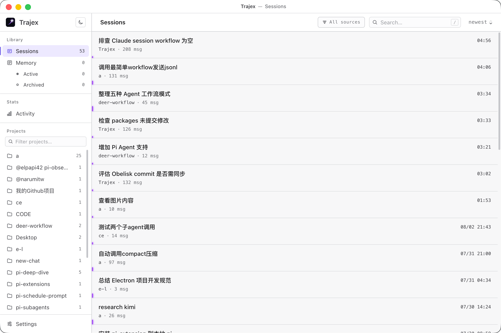
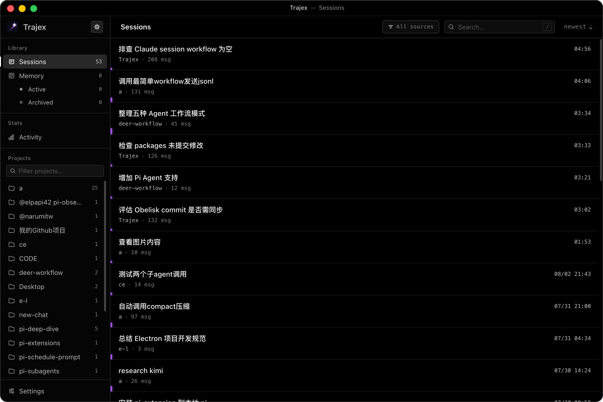
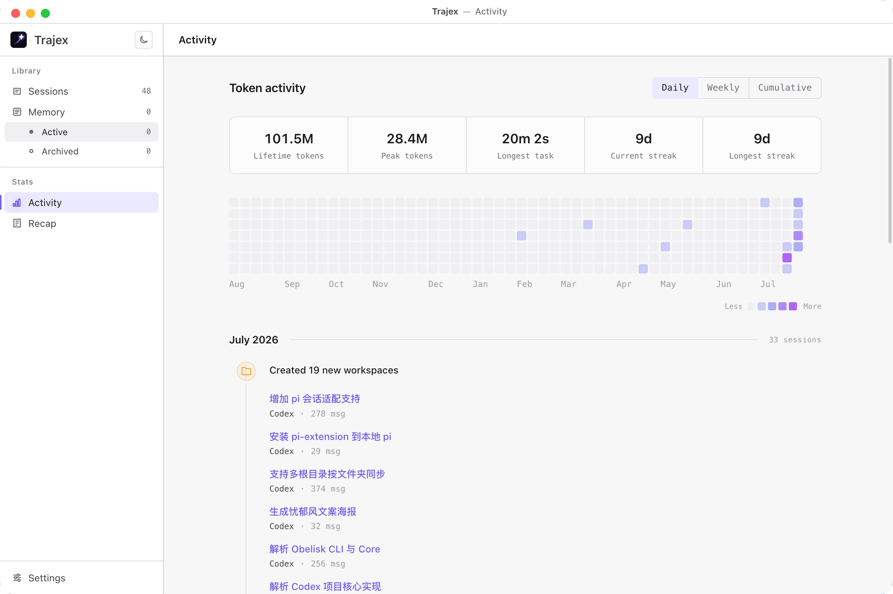
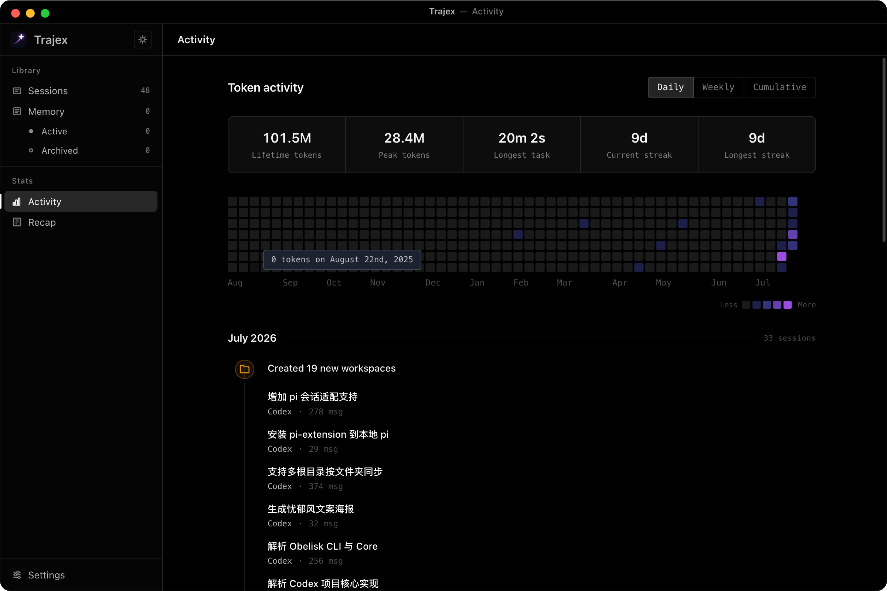
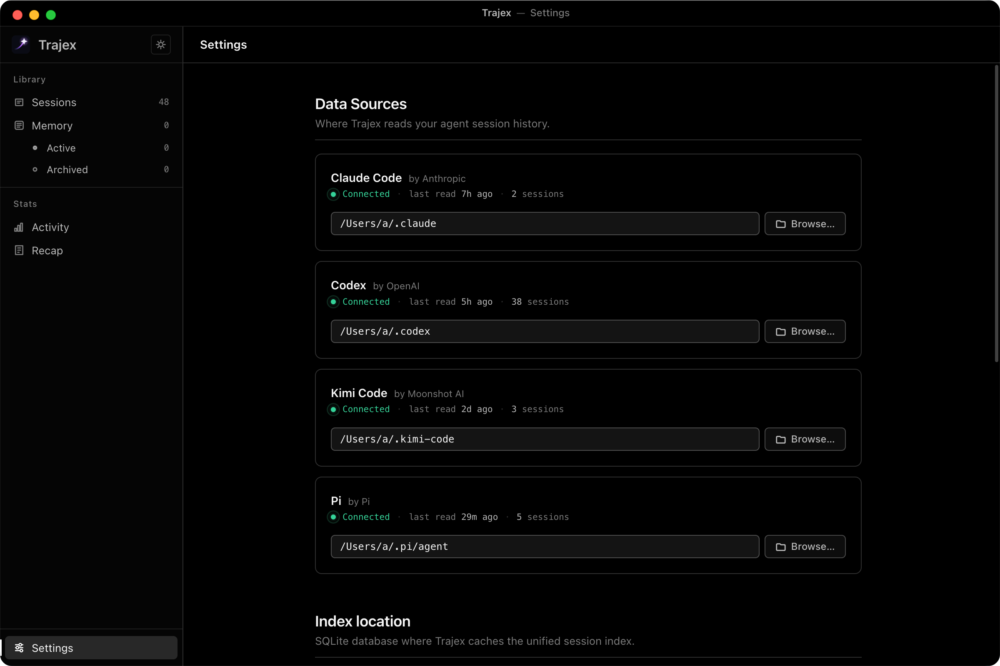
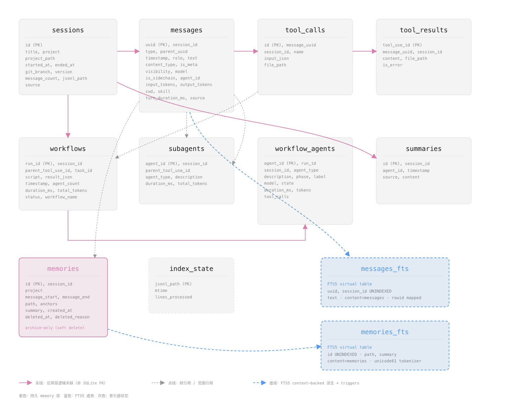

<p align="right">
  <a href="README.md">中文</a> &nbsp;|&nbsp; <a href="README.en.md">English</a>
</p>

<div align="center">

<picture>
  <source media="(prefers-color-scheme: dark)" srcset=".github/assets/trajex-wordmark-d.svg">
  
</picture>

<a href="https://github.com/wutongyuonce/Trajex/stargazers"></a>
<a href="https://github.com/wutongyuonce/Trajex/releases"></a>
<a href="LICENSE"></a>

**[Trajex](https://github.com/wutongyuonce/Trajex) | A general-purpose local session-memory platform for agents**

Parses JSONL history from different providers — Codex, Claude Code, Pi — into one canonical record set persisted in SQLite, with millisecond-scale history retrieval via the FTS5 full-text index.

* Built on the **CodeAct agent design paradigm**, with a programmable JS Query API that lets agents make **“writing executable code”** their core mode of action (searching historical evidence, distilling experience into durable memory);

* Ships with an Electron + Vue desktop app that turns the same index into a readable session timeline for humans to browse.

</div>

## Acknowledgements

Trajex is a fork product of [tommy0103/obelisk](https://github.com/tommy0103/obelisk). It substantially reworks the desktop app, including a Codex-like vertical progress rail and local-file link previews, and adds Pi session support.

## Two Sides of One Index

Trajex has two sides sharing the same SQLite index:

**Agent side** — The `trajex` CLI provides the local runtime; a separate agent skill teaches coding agents how to search and query their own session history. Agents write JS queries, run them locally, and answer in natural language.

**App side** — An Electron desktop app for humans to browse sessions, manage memories, and view usage statistics.

Both read the same `~/.trajex/trajex.sqlite` database. The indexer consumes Claude Code transcripts from `~/.claude/projects`, Codex transcripts from `~/.codex/sessions`, and Pi sessions from `~/.pi/agent/sessions`.

## Multi-Provider Support

Codex and Claude Code are processed according to schemas derived from testing real files; neither vendor publishes a format specification.

Trajex indexes every provider into the same SQLite schema rather than maintaining separate databases. Rows carry a `source` value; non-Claude IDs are provider-prefixed to avoid collisions.

| Provider | Internal id shape | Reason |
|---|---|---|
| Claude | `e9d4f0a1-…` (as-is) | Native format |
| Codex | `codex:6f3c2a9e-…` | Avoid primary-key collisions with Claude's UUIDs |
| Pi | `pi:<raw-id>:<cwd-hash>` | Tree-shaped sessions, scoped per project/branch |

> * Claude / Codex: their ids are globally unique at the session level;
> * Pi: the default id is also globally unique (uuidv7), but Pi supports explicitly passing project-local ids such as `--session-id` (uniqueness is not enforced), and the same session file may appear under multiple project directories. So relying on the raw id alone can collide across projects; folding the cwd hash into the primary key is a defensive fallback (and keeps identity stable when files move).

Only Codex root threads become regular Trajex sessions. Codex child/fork/subagent threads, including guardian/auto-review threads, are ignored when parent-thread metadata or `thread_source: "subagent"` identifies them; they are not attached to `subagents`. Codex does not emit Claude-style workflow metadata, so workflow-related tables may be empty when only Codex history is present. Like Pi, Codex fully replays changed files: it first deletes the session's old derived projection, then rebuilds it entirely from the current JSONL.

Each official Pi v3 session JSONL file becomes a Trajex session. Pi entries form a tree, so Trajex resolves the durable leaf and compaction forms, including retained tails: current context is `visible`, superseded branch evidence is `inactive`, and source-suppressed transport context is `hidden`. The detail view shows visible records by default and lets readers explicitly expand inactive evidence.

To support live app refresh, Trajex watches each registered provider's declared roots: Claude's `~/.claude/projects`, Codex's `~/.codex/sessions` (plus `session_index.jsonl`), and Pi's default `~/.pi/agent/sessions`. In App Settings, Claude and Codex take the provider root (default `~/.claude` / `~/.codex`), and Trajex appends `projects` / `sessions` to it for discovery and watching; Pi takes the final session directory and Trajex appends nothing to it, so you can fill in the directory resolved from `PI_CODING_AGENT_SESSION_DIR` directly, or the `sessions` subdirectory under the directory resolved from `PI_CODING_AGENT_DIR` (i.e. `$PI_CODING_AGENT_DIR/sessions`). Trajex does not read environment variables or CLI arguments. Codex's `session_index.jsonl` is used only as lightweight title/update metadata during indexing, not as a message transcript source.

## App and CLI Relationship

The desktop app and CLI install independently: installing the app does not require the CLI, and installing the CLI does not require a separate Core installation. Each carries the Core it needs at runtime, and both share the same local index database when used simultaneously.

* The CLI has no runtime npm dependencies and uses Node 22's built-in `node:sqlite` with FTS5.

* The App has runtime npm dependencies: `better-sqlite3` (SQLite driver) and `chokidar` (file watching). This is because Electron does not use Node's `node:sqlite` and instead uses a native SQLite driver.

The first time you open the app or run a CLI query with `/trajex --build`, the index is built. Once either side has built it, the other reuses the same index, typically only doing incremental checks/updates. 100 sessions usually takes about 5 seconds. Subsequent runs use incremental rebuilds.

Only new or modified JSONL files are re-parsed. Incremental indexing only upserts and never cleans up stale content: derived rows for deleted or corrupted transcripts remain in SQLite. Only a rebuild (forced full re-index) can remove stale content, but the CLI and App rebuild at different levels: the CLI's `/trajex --build` only clears derived tables such as sessions and messages and re-indexes from the current on-disk files (record-level rebuild); it does not rebuild the SQLite file itself — to rebuild the file from scratch you must first delete `~/.trajex/trajex.sqlite` and rebuild. The App's manual rebuild is the opposite: it first builds a brand-new temporary database, copies the old database's memories, and atomically replaces the main database file on success — equivalent to rebuilding the SQLite file and applying the current schema. Both rebuilds preserve the human-confirmed memories layer. New schema columns are applied idempotently by migrations (schema-migrations) on database open; migrations only add new columns, never drop old ones. Old columns disappear only when a rebuild produces a new database. When the optional app is running, it acts as the active indexer: it watches project files and builds the index in a worker thread. The presence of a fresh `__app_heartbeat__` means the daemon holds write responsibility, so CLI calls remain read-only; a separate SQLite writer lease prevents cross-process write overlap. The `__app_last_successful_build__` marker does not participate in write arbitration — it records app index freshness for observability only.

## App: A Human Interface

A companion desktop app for browsing the same index maintained by the CLI or the app daemon.

<div align="center">
  
</div>

<div align="center">
  
</div>

<div align="center">
  
</div>

<div align="center">
  
</div>

<div align="center">
  
</div>

<div align="center">
  
</div>

<div align="center">
  
</div>

<div align="center">
  
</div>

- **Sessions** — Browse all sessions with search, project filtering, readable tool calls including diffs, terminal output, file viewers
- **Memory** — List and detail view for registered memory files
- **Activity** — GitHub-style heatmap, weekly/cumulative token charts
- **Settings** — Data source configuration, auto-refresh, index rebuild

Prebuilt macOS binaries are available on [Releases](https://github.com/wutongyuonce/trajex/releases). The source app runs locally on macOS, Windows, and Linux.

## Installing the CLI and Skill

### Recommended: Let an Agent Install

Pass the root-level [`SKILL.md`](SKILL.md) as a prompt to a coding agent with shell access, or have it read the installation guide below:

```text
Please read and follow this installation guide to set up Trajex:
https://raw.githubusercontent.com/wutongyuonce/trajex/main/SKILL.md
```

`trajex-installer` first installs and verifies the CLI, then asks whether to install the `/trajex` skill for the current project or globally; it never changes the installation scope without asking.

### Manual Install/Update

Trajex requires Node.js 22.13 or later. Install the platform-independent CLI:

```bash
npm install --global @trajex-apps/cli
trajex --version
```

On macOS, Linux, or WSL, the CLI-only installer is equivalent to:

```bash
curl -fsSL https://raw.githubusercontent.com/wutongyuonce/trajex/main/install.sh | sh
```

Then install the `/trajex` skill. Defaults to the current project; add `--global` for system-wide availability:

```bash
npx --yes skills add wutongyuonce/trajex-skill
# or: npx --yes skills add wutongyuonce/trajex-skill --global
```

## Using the trajex-skill

Here are some example queries:

```
/trajex what files did we end up changing for that auth bug, and why
/trajex which recent sessions have been modifying this file repeatedly
/trajex find the most recent failed tool calls and what tasks they belong to
/trajex what did each subagent conclude in that review workflow
```

### How It Works

```
You ask a question
  ↓
Agent writes a JS query against the SQLite index
  ↓
Runs it via trajex --query <script>
  ↓
Reads JSON results, answers in natural language
```

Core API: `search()`, `context()`, `sql()`, and structured helpers: `sessions`, `memories`, `summaries`, `workflows`, `failures`, `fileHistory`, and more.

### Memory Layer

When a retrieval produces a conclusion worth keeping, the agent proposes a markdown memory file. After user approval, it registers the file via `trajex --attune <script>`. Future sessions can recall these memories through `memories()`. It is a synthesis cache, not a replacement for raw evidence.

## Running the App Locally

Install [Node.js 22](https://nodejs.org/) and npm, then run from the app's own package directory:

```bash
git clone https://github.com/wutongyuonce/trajex.git
cd trajex/app
npm ci
npm run dev
```

`electron-vite` starts the renderer dev server and opens Electron. On first run, Trajex creates `~/.trajex/trajex.sqlite`, indexes available Claude Code, Codex, and Pi transcripts, then watches them for changes. Default sources can be changed to other directories in **Settings**. On Windows, Trajex also checks common WSL distributions for Claude Code directories.

## Debugging the App

- Renderer changes use Vite hot module replacement. Open Electron DevTools with `Cmd+Option+I` on macOS or `Ctrl+Shift+I` on Windows/Linux.
- Main-process and preload logs appear in the terminal running `npm run dev`; their source changes are rebuilt by electron-vite.
- To attach a Node debugger to the Electron main process, start with `npm run dev -- --inspect=5858` and attach your debugger to port 5858.
- The development app reads and updates the real `~/.trajex` index. Back it up before testing destructive rebuilds. To run in isolation, use a disposable home directory — for example, `HOME=/tmp/trajex-dev npm run dev` on macOS/Linux, or temporarily set `USERPROFILE` on Windows, then select fixture source directories in **Settings**.

`better-sqlite3` ships prebuilt binaries for common platforms. If `npm ci` falls back to a local build, install the C/C++ build tools for your platform and re-run `npm ci`.

## Building and Packaging the App

Run these commands from `app/`:

```bash
# Compile main, preload, and renderer and package (electron-builder produces
# installers for the current platform; on macOS this is equivalent to dist:mac).
# Run npx electron-vite build if you only want compiled output.
npm run build

# Generate an unpacked app directory
npm run pack

# Generate macOS DMG and ZIP installers
npm run dist:mac
```

The flow first compiles Electron's main/preload/renderer processes with
`electron-vite`, then uses `electron-builder` to rebuild native dependencies,
assemble the app, and generate installers. Artifacts are written to
`app/release/`; `npm run pack` generates `release/mac-arm64/Trajex.app`, while
`npm run dist:mac` generates the DMG and ZIP. Without an Apple Developer ID,
the artifacts are unsigned. When compiling only, `electron-vite` writes its
output to `app/out/`.

## Publishing the npm Package

Only `@trajex-apps/cli` is published to npm; `@trajex/core` is a private
workspace that is compiled directly into the CLI at build time and is not
published separately.

### Prerequisites

- Logged in to npm, with an account that is a member of the organization owning
  the `@trajex-apps` scope and has publish permissions (Owner/Admin);
- The account has 2FA enabled (npm requires it for publishers). Publishing uses
  the session token generated by `npm login`, or an access token with
  bypass-2FA permission.

### Publishing Steps

```bash
# 1. Log in (one-time)
npm login

# 2. Bump the version: must bump before every publish; npm does not allow
#    overwriting an already-published version
npm version patch -w @trajex-apps/cli
# or a specific version (--no-git-tag-version: changes files only, no git tag/commit):
npm version 0.2.1 -w @trajex-apps/cli --no-git-tag-version

# 3. Publish (the prepack hook automatically runs build:cli before uploading)
npm publish --workspace @trajex-apps/cli

# 4. Verify
npm view @trajex-apps/cli version
npm i -g @trajex-apps/cli   # update globally locally
```

### Notes

- `packages/cli`'s `prepack: "npm run build"` guarantees the published payload
  is always a fresh build;
- `files: ["dist", "README.md"]` determines the tarball contents, and
  `publishConfig.access: "public"` allows the org-scoped package to be published
  as public;
- If you bump the version by mistake, you can roll back at any time with
  `npm version <version> -w @trajex-apps/cli --no-git-tag-version` as long as
  you have **not published** yet;
- `npm view` may briefly return 404 immediately after publishing (registry CDN
  propagation delay); wait a moment and retry.

## SQLite Schema

<div align="center">
  
</div>

| Layer | Source | Capture Content |
|-------|--------|----------------|
| **Sessions** | Claude `<project>/<sessionId>.jsonl`; Codex `sessions/YYYY/MM/DD/*.jsonl`; Pi recursive official v3 `*.jsonl` | Title, project, timestamps, git branch, source |
| **Messages** | user + assistant turns | Full text, model, token usage, parent chain |
| **Tool calls** | every tool invocation | Tool name, input, file paths |
| **Subagents** | Claude `subagents/agent-<id>.jsonl` | Agent type, description, full conversation |
| **Workflows** | Claude `workflows/wf_<runId>.json` | Script, result, agent count |
| **Workflow agents** | Claude `subagents/workflows/wf_<runId>/` | Per-agent transcripts |
| **Memories** | registered markdown files | Conclusions linked to source sessions |

Full-text search via FTS5 covers all layers.

## Structure

```
packages/core/                # @trajex/core npm workspace (TypeScript + ESM)
├── src/
│   ├── providers/
│   │   ├── types.ts          # Provider + TranscriptRecord contract
│   │   ├── claude.ts         # Claude Code adapter (line-incremental)
│   │   ├── codex.ts          # Codex adapter (full reparse)
│   │   └── pi.ts             # Pi adapter (v3 context + visibility projection)
│   ├── session-detail.ts     # Provider-independent transcript projection
│   ├── persist.ts            # Binding-agnostic record writer (upsert/merge)
│   ├── tx.ts                 # Write transaction + connection config
│   ├── write-coordinator.ts  # Bounded retry policy
│   ├── writer-lease.ts       # Cross-process single-writer lease (SQLite lock DB)
│   ├── core.ts               # buildIndex / searchText / executeQuery / executeAttune
│   ├── indexer.ts            # Skill orchestration (discover → persist → finalize)
│   ├── parsing.ts            # Pure helpers (node:sqlite-free, app-consumable)
│   ├── db.ts                 # node:sqlite lifecycle + migrations
│   ├── query.ts              # Query/attune sandbox API (helpers)
│   └── schema.sql            # SQLite schema (single source of truth)
├── package.json
└── dist/                     # Generated package JS, declarations, and schema

packages/cli/                 # @trajex-apps/cli npm workspace
├── src/trajex.ts            # CLI shell
├── scripts/build.mjs         # Compiles CLI + readable Core into one package
├── package.json
└── dist/                     # Generated platform-neutral npm payload

trajex-skill/                    # Source for the docs-only trajex agent skill
├── SKILL.md                  # Query and memory workflow
└── references/               # Progressive-disclosure API/schema/pattern docs

app/                          # Electron desktop app (electron-vite + Vue)
├── src/main/                 # TypeScript main process (consumes shared core)
├── src/preload/              # CJS preload (sandbox)
├── src/renderer/             # Vue renderer
└── electron.vite.config.ts

install.sh                    # POSIX CLI-only installer
CONTEXT.md                    # Project glossary
docs/adr/                     # Architecture decision records (0001–0006)
```

### Build Artifacts

- `packages/core/dist/` is produced by `npm run build:core`. It is the compiled internal `@trajex/core` workspace: JavaScript, type declarations, and `schema.sql`.
- `packages/cli/dist/` is produced by `npm run build:cli`. It is the publishable `@trajex-apps/cli` payload: a thin command shell, readable compiled Core, and `schema.sql`.
- `packages/cli/dist/` is generated — do not edit manually. The Electron app imports `packages/core/src/` directly so that electron-vite can bundle Core.
