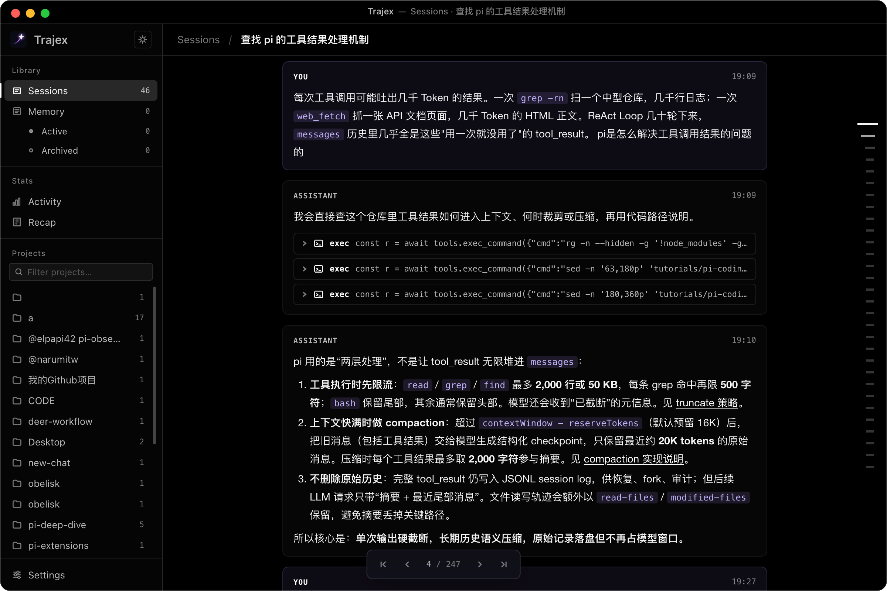
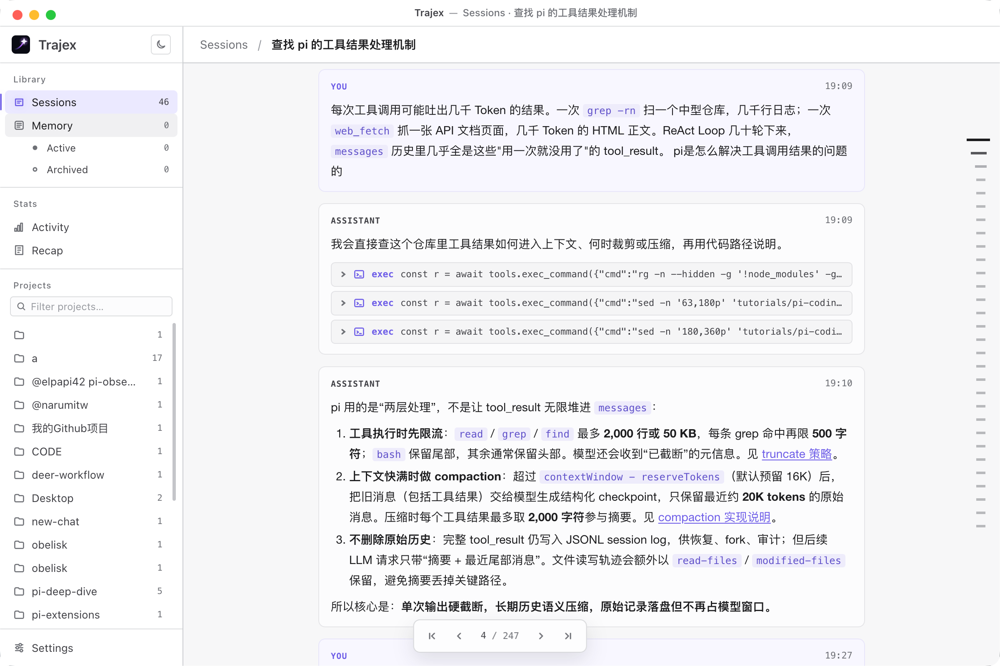

<div align="center">

<picture>
  <source media="(prefers-color-scheme: dark)" srcset=".github/assets/trajex-wordmark-d.svg">
  
</picture>

<a href="https://github.com/wutongyuonce/Trajex/stargazers"></a>
<a href="https://github.com/wutongyuonce/Trajex/releases"></a>

数万行散落的 Claude Code、Codex、Kimi Code 与 Pi JSONL 会话，索引至同一个 SQLite 中：<br>
Agent 可通过 CLI /Skill 实现毫秒级查询，用户可通过 App 直观浏览。

</div>

## 同一个索引的两面

Trajex 有两面，它们共享同一个 SQLite 索引：

**Agent 侧** — `trajex` CLI 负责本地运行时；另有一个独立的 Agent skill 教会 coding agents 如何搜索和查询自己的会话历史。Agent 会编写 JS 查询，在本地运行，并用自然语言回答。

**App 侧** — Electron 桌面 app，供人浏览 sessions、管理 memories、查看使用统计，以及查看每周 recap cards。

两者都读取同一个 `~/.trajex/trajex.sqlite` 数据库。索引器会读取 `~/.claude/projects` 中的 Claude Code transcripts、`~/.codex/sessions` 中的 Codex transcripts、`~/.kimi-code/sessions` 或 `$KIMI_CODE_HOME/sessions` 中的 Kimi Code sessions，以及 `~/.pi/agent/sessions` 中的 Pi sessions。

## 多 Provider 支持

Trajex 会把每个 provider 都索引到同一个 SQLite schema 中，而不是维护彼此分离的数据库。数据行会带有 `source` 值；非 Claude 的 ID 会带 provider 前缀，因此不会冲突。

Codex root threads 会成为普通 Trajex sessions。当 parent-thread metadata 可用时，Codex child threads 会通过同一个 `subagents` 表挂接。Codex 不会产生 Claude 风格的 workflow metadata，因此只有 Codex 历史时，workflow 相关表可能为空。

Kimi session directories 会各自成为一个 Trajex session。主会话和 child-agent 的 `wire.jsonl` streams 会被投影到同一套 messages、tools、summaries 和 subagents 表。undo/clear 会以完整 session replay 方式处理，因此被撤回的 wire records 不会残留在索引中。

每个 Pi session JSONL 文件会成为一个 Trajex session。Pi 的会话条目是树状的，因此 Trajex 会保存全部分支，并将不在最新叶节点路径上的消息标记为 sidechain；详情页默认折叠这些其他分支。

为了支持 app 实时刷新，Trajex 会监听每个已注册 provider 声明的 roots，包括 `~/.claude/projects`、`~/.codex/sessions`、`~/.kimi-code/sessions` 和 `~/.pi/agent/sessions`。在 Settings 中修改 Pi 路径时，应填写 Pi agent root，Trajex 会读取其 `sessions` 子目录。Codex 的 `session_index.jsonl` 在索引期间只作为轻量 title/update metadata 使用，而不是消息 transcript 来源。

## App 与 CLI 的关系

桌面 App 和 CLI 可以独立安装：安装 App 不需要先安装 CLI，安装 CLI 也不需要单独安装 Core。两者各自携带运行所需的 Core，并在同时使用时共享同一个本地索引数据库。

* CLI 没有运行时 npm dependencies，并使用 Node 22 内置的 `node:sqlite` 与 FTS5。

* App 有运行时 npm dependencies：`better-sqlite3`（SQLite 驱动）和 `chokidar`（文件监听）。这是因为 Electron 侧没有使用 Node 的 `node:sqlite`，而是使用原生 SQLite 驱动。

第一次打开 App 或者第一次运行 CLI 查询 `/trajex --build` 会构建索引，其中一方已完成后，另一方复用同一份索引，通常只做增量检查/更新。100 个 sessions 通常需要约 5 秒。之后会进行增量重建。

只有新增或修改过的 JSONL 文件会被重新解析。当可选 app 正在运行时，它就是 active indexer：它监听 project files，并在 worker thread 中构建索引。仅凭新鲜的 `__app_heartbeat__` 就意味着 daemon 拥有写入职责，因此 CLI 调用会保持只读；另有一个独立的 SQLite writer lease 防止跨进程写入重叠。`__app_last_successful_build__` marker 不参与写入判断，记录的是 App 索引新鲜度，仅用于观测记录。

## App：给人使用的界面

一个配套桌面 app，用于浏览由 CLI 或 app daemon 维护的同一个索引。

<div align="center">
  
</div>


<div align="center">
  
</div>

- **Sessions** — 浏览所有 sessions，支持搜索、项目过滤、可读 tool calls，包括 diffs、terminal output、file viewers
- **Memory** — 已注册 memory files 的列表和详情视图
- **Activity** — GitHub 风格热力图、每周/累计 token 图表
- **Recap** — 可分享的周/月 recap cards，带 archetype theming
- **Settings** — 数据源配置、自动刷新、重建索引

目前 macOS 预构建版本可在 [Releases](https://github.com/wutongyuonce/trajex/releases) 获取。源码 app 可在 macOS、Windows 和 Linux 上本地运行。

## 安装 CLI 和 Skill

### 推荐：交给 Agent 安装

将根目录的 [`SKILL.md`](SKILL.md) 作为 prompt 交给有 shell 权限的
coding Agent，或让它读取下面的安装指南：

```text
请读取并按此安装指南完成 Trajex 安装：
https://raw.githubusercontent.com/wutongyuonce/trajex/main/SKILL.md
```

`trajex-installer` 会先安装并验证 CLI，再询问将 `/trajex` skill 安装到当前
项目还是全局；不会擅自改变安装范围。

### 手动安装/更新

Trajex 需要 Node.js 22.13 或更高版本。安装平台无关的 CLI：

```bash
npm install --global @trajex-apps/cli
trajex --version
```

在 macOS、Linux 或 WSL 上，CLI-only installer 等价于：

```bash
curl -fsSL https://raw.githubusercontent.com/wutongyuonce/trajex/main/install.sh | sh
```

然后安装 `/trajex` skill。默认安装到当前项目；如需全局可用，加上 `--global`：

```bash
npx --yes skills add wutongyuonce/trajex-skill
# 或：npx --yes skills add wutongyuonce/trajex-skill --global
```

## 使用 trajex-skill

你可以这样使用 trajex-skill：

```
/trajex 上次 auth bug 最后到底改了哪些文件，为什么这么改
/trajex 这个文件最近在哪些 sessions 里被反复修改
/trajex 找出最近失败的 tool calls，它们分别发生在哪些任务里
/trajex 那个 review workflow 的 subagents 各自结论是什么
/trajex recap this week
/trajex recap this month
```

### 工作原理

```
你提出问题
  ↓
Agent 针对 SQLite 索引编写 JS 查询
  ↓
通过 trajex --query <script> 运行
  ↓
读取 JSON 结果，用自然语言回答
```

核心 API：`search()`、`context()`、`sql()`，以及结构化 helpers：`sessions`、`memories`、`summaries`、`workflows`、`failures`、`fileHistory` 等。

### Memory 层

当一次检索产生了值得保留的结论时，Agent 会提出一个 markdown memory file。经过用户批准后，它会通过 `trajex --attune <script>` 注册该文件。未来 sessions 中可以通过 `memories()` 召回这些 memories。它是一个 synthesis cache，不是原始证据的替代品。

## 本地运行 App

安装 [Node.js 22](https://nodejs.org/) 和 npm，然后从 app 自己的 package 目录运行：

```bash
git clone https://github.com/wutongyuonce/trajex.git
cd trajex/app
npm ci
npm run dev
```

`electron-vite` 会启动 renderer dev server 并打开 Electron。首次运行时，Trajex 会创建 `~/.trajex/trajex.sqlite`，索引可用的 Claude Code、Codex、Kimi Code 和 Pi transcripts，然后监听它们的变化。默认 sources 可在 **Settings** 中改为其他目录。在 Windows 上，Trajex 还会检查常见 WSL distributions 中的 Claude Code 目录。

## 调试 App

- Renderer 改动使用 Vite hot module replacement。在 macOS 上用 `Cmd+Option+I`，在 Windows/Linux 上用 `Ctrl+Shift+I` 打开 Electron DevTools。
- Main-process 和 preload logs 会出现在运行 `npm run dev` 的终端中；它们的源码改动由 electron-vite 重新构建。
- 如果要把 Node debugger attach 到 Electron main process，用 `npm run dev -- --inspect=5858` 启动，然后把 debugger attach 到 5858 端口。
- development app 会读取并更新真实的 `~/.trajex` 索引。在测试破坏性 rebuild 前请先备份。要隔离运行，可以用 disposable home directory 启动，例如 macOS/Linux 上 `HOME=/tmp/trajex-dev npm run dev`，Windows 上先设置临时 `USERPROFILE`，然后在 **Settings** 中选择 fixture source directories。

`better-sqlite3` 为常见平台提供预构建 binaries。如果 `npm ci` 回退到本地编译，请安装对应平台的 C/C++ 构建工具，然后重新运行 `npm ci`。

## 会索引哪些内容

| Layer | Source | 捕获内容 |
|-------|--------|----------|
| **Sessions** | Claude `<project>/<sessionId>.jsonl`; Codex `sessions/YYYY/MM/DD/*.jsonl`; Pi `sessions/<project>/*.jsonl` | Title、project、timestamps、git branch、source |
| **Messages** | user + assistant turns | Full text、model、token usage、parent chain |
| **Tool calls** | every tool invocation | Tool name、input、file paths |
| **Subagents** | Claude `subagents/agent-<id>.jsonl`; Codex child threads | Agent type、description、full conversation |
| **Workflows** | Claude `workflows/wf_<runId>.json` | Script、result、agent count |
| **Workflow agents** | Claude `subagents/workflows/wf_<runId>/` | Per-agent transcripts |
| **Memories** | registered markdown files | Conclusions linked to source sessions |

通过 FTS5 实现的全文搜索会覆盖所有 layers。

## 结构

```
packages/core/                # @trajex/core npm workspace（TypeScript + ESM）
├── src/
│   ├── providers/
│   │   ├── types.ts          # Provider + TranscriptRecord contract
│   │   ├── claude.ts         # Claude Code adapter（行增量）
│   │   ├── codex.ts          # Codex adapter（全量重解析）
│   │   └── kimi.ts           # Kimi Code adapter（session projection）
│   │   └── pi.ts             # Pi adapter（tree + sidechain projection）
│   ├── session-detail.ts     # Provider-independent transcript projection
│   ├── persist.ts            # Binding-agnostic record writer（upsert/merge）
│   ├── tx.ts                 # Write transaction + connection config
│   ├── write-coordinator.ts  # Bounded retry policy
│   ├── writer-lease.ts       # Cross-process single-writer lease（SQLite lock DB）
│   ├── core.ts               # buildIndex / searchText / executeQuery / executeAttune
│   ├── indexer.ts            # Skill orchestration（discover → persist → finalize）
│   ├── parsing.ts            # Pure helpers（node:sqlite-free, app-consumable）
│   ├── db.ts                 # node:sqlite lifecycle + migrations
│   ├── query.ts              # Query/attune sandbox API（helpers）
│   └── schema.sql            # SQLite schema（single source of truth）
├── package.json
└── dist/                     # Generated package JS, declarations, and schema

packages/cli/                 # @trajex-apps/cli npm workspace
├── src/trajex.ts            # CLI shell
├── scripts/build.mjs         # Compiles CLI + readable Core into one package
├── package.json
└── dist/                     # Generated platform-neutral npm payload

trajex-skill/                    # docs-only trajex agent skill 的源码
├── SKILL.md                  # Query and memory workflow
└── references/               # Progressive-disclosure API/schema/pattern docs
    └── recap/                # Per-card recap retrieval + writing references

app/                          # Electron desktop app（electron-vite + Vue）
├── src/main/                 # TypeScript main process（consumes shared core）
├── src/preload/              # CJS preload（sandbox）
├── src/renderer/             # Vue renderer
└── electron.vite.config.ts

install.sh                    # POSIX CLI-only installer
CONTEXT.md                    # Project glossary
docs/adr/                     # Architecture decision records（0001–0006）
```

可选的 `/trajex recap` 流程只会在显式 `/trajex recap` 意图下加载。它从 `trajex-skill/references/recap/overview.md` 开始，并按卡片逐步推进：

- `skill-doc/references/recap/pattern1-cover.md` + `skill-doc/references/recap/writing1-cover.md`
- `skill-doc/references/recap/pattern2-thinking.md` + `skill-doc/references/recap/writing2-thinking.md`
- `skill-doc/references/recap/pattern3-vibe.md` + `skill-doc/references/recap/writing3-vibe.md`
- `skill-doc/references/recap/pattern4-workflow.md` + `skill-doc/references/recap/writing4-workflow.md`
- `skill-doc/references/recap/pattern5-closing.md` + `skill-doc/references/recap/writing5-closing.md`

### 生成的构建产物

- `packages/core/dist/` 由 `npm run build:core` 生成。它是编译后的内部 `@trajex/core` workspace：JavaScript、type declarations 和 `schema.sql`。
- `packages/cli/dist/` 由 `npm run build:cli` 生成。它是可发布的 `@trajex-apps/cli` payload：薄命令 shell、可读的 compiled Core，以及 `schema.sql`。
- `packages/cli/dist/` 是生成产物，不应该手动编辑。Electron app 会直接 import `packages/core/src/`，以便 electron-vite 可以 bundle Core。

---

## Acknowledgements

Trajex is a fork of [tommy0103/obelisk](https://github.com/tommy0103/obelisk). It substantially reworks the desktop app, including a Codex-like vertical progress rail and local-file link previews, and adds Pi session support.

## License

AGPL-3.0 @wutongyuonce
