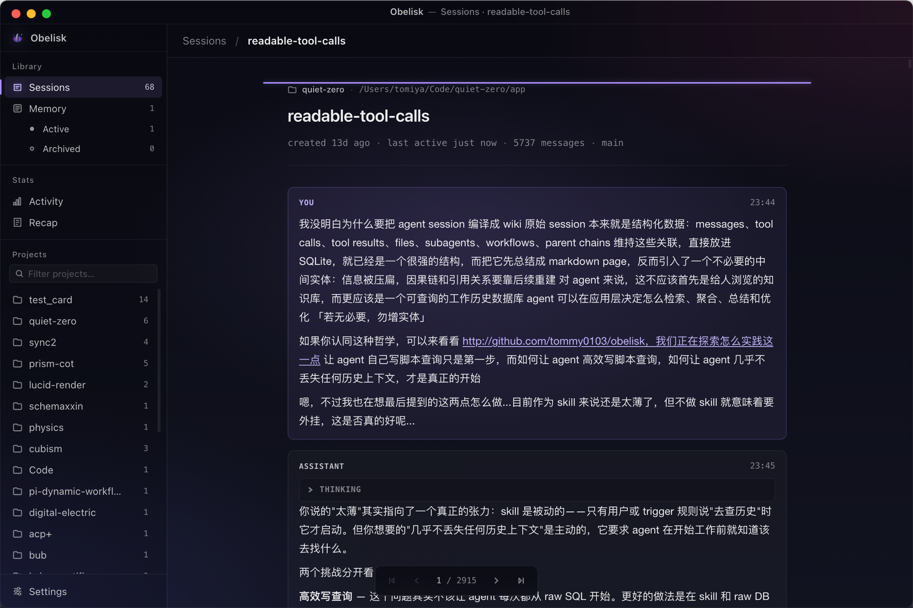

<div align="center">

<picture>
  <source media="(prefers-color-scheme: dark)" srcset=".github/assets/obelisk-wordmark-d.svg">
  
</picture>

[](https://github.com/tommy0103/obelisk/stargazers)
[](https://github.com/tommy0103/obelisk/releases)
[](LICENSE)

Past Claude Code, Codex, and Kimi Code sessions -- queryable by your agent, browsable by you.

</div>

<br />

## Two sides of the same index

Obelisk has two sides that share one SQLite index:

**Agent side** — the `obelisk` CLI owns the local runtime, while a separate
agent skill teaches coding agents how to search and query their session history.
The agent writes JS queries, runs them locally, and answers in plain language.

**App side** — an Electron desktop app for humans to browse sessions, manage memories, view usage stats, and see weekly recap cards.

Both read from the same `~/.obelisk/obelisk.sqlite` database. The indexer reads Claude Code transcripts from `~/.claude/projects`, Codex transcripts from `~/.codex/sessions`, and Kimi Code sessions from `~/.kimi-code/sessions` (or `$KIMI_CODE_HOME/sessions`).

## Multi-provider support

Obelisk indexes every provider into the same SQLite schema instead of keeping separate databases. Rows carry a `source` value, and non-Claude IDs are provider-prefixed so they cannot collide.

Codex root threads become normal Obelisk sessions. Codex child threads are attached through the same `subagents` table when parent-thread metadata is available. Codex does not emit Claude-style workflow metadata, so workflow tables may be empty for Codex-only history.

Kimi session directories become one Obelisk session each. Main and child-agent
`wire.jsonl` streams are projected into the same messages, tools, summaries and
subagents tables. Undo/clear is handled as a full session replay, so retracted
wire records do not remain in the index.

For live app refresh, Obelisk watches the roots declared by every registered provider, including `~/.claude/projects`, `~/.codex/sessions`, and `~/.kimi-code/sessions`. Codex's `session_index.jsonl` is used as lightweight title/update metadata during indexing, not as the message transcript source.

## Skill: agent-first retrieval

<div align="center">
  
</div>

You can use obelisk like:

```
/obelisk 上次 auth bug 最后到底改了哪些文件，为什么这么改
/obelisk 这个文件最近在哪些 sessions 里被反复修改
/obelisk 找出最近失败的 tool calls，它们分别发生在哪些任务里
/obelisk 那个 review workflow 的 subagents 各自结论是什么
/obelisk recap this week
```

### Install

#### Let your agent install it (recommended)

The shortest path is to give the bootstrap guide directly to a coding agent
with shell access. Paste this as a prompt into Claude Code, Codex, or another
agent — not into your terminal:

```text
Install Obelisk by fetching and following this guide:
curl -fsSL https://raw.githubusercontent.com/tommy0103/obelisk/main/SKILL.md
```

The agent will ask before changing your machine, install and verify the CLI,
then ask whether the formal `/obelisk` skill should be installed for the current
project or globally. The bootstrap guide is only for one-time setup; it is not
the query skill itself.

#### Install manually

Obelisk requires Node.js 22.13 or newer. Install the platform-neutral CLI:

```bash
npm install --global @obelisk-apps/cli
obelisk --version
```

On macOS, Linux, or WSL, the CLI-only installer is equivalent:

```bash
curl -fsSL https://raw.githubusercontent.com/tommy0103/obelisk/main/install.sh | sh
```

Then install the agent skill:

```bash
obelisk install
```

`obelisk install` delegates to the standard skills installer for
`tommy0103/obelisk-skill`.

Then in any Claude Code session:

```
/obelisk <your question>
```

First run builds the index (~5 seconds for 100 sessions). After that it rebuilds incrementally.

### How it works

```
You ask a question
  ↓
Agent writes a JS query against the SQLite index
  ↓
Runs it via obelisk --query <script>
  ↓
Reads the JSON result, answers in natural language
```

Core API: `search()`, `context()`, `sql()`, plus structured helpers (`sessions`, `memories`, `summaries`, `workflows`, `failures`, `fileHistory`, etc).

### Memory layer

When a retrieval produces a conclusion worth keeping, the agent proposes a markdown memory file. After user approval, it registers the file with `obelisk --attune <script>`. Memories are recalled via `memories()` in future sessions — a synthesis cache, not a replacement for raw evidence.

## App: A surface for humans

A companion desktop app for browsing the same index maintained by the CLI or
the app daemon.

<div align="center">
  
</div>

- **Sessions** — browse all sessions with search, project filtering, readable tool calls (diffs, terminal output, file viewers)
- **Memory** — list and detail views for registered memory files
- **Activity** — GitHub-style heatmap, weekly/cumulative token charts
- **Recap** — shareable weekly/monthly recap cards with archetype theming
- **Settings** — data source configuration, auto-refresh, rebuild index

Prebuilt releases are currently available for macOS from
[Releases](https://github.com/tommy0103/obelisk/releases). The source app can be
run locally on macOS, Windows, and Linux.

### Run locally

Install [Node.js 22](https://nodejs.org/) and npm, then run the app from its own
package directory:

```bash
git clone https://github.com/tommy0103/obelisk.git
cd obelisk/app
npm ci
npm run dev
```

`electron-vite` starts the renderer dev server and launches Electron. On first
run, Obelisk creates `~/.obelisk/obelisk.sqlite`, indexes the available Claude
Code and Codex transcripts, and then watches them for changes. The default
sources are `~/.claude/projects` and `~/.codex/sessions`; use **Settings** to
point the app at different directories. On Windows, Obelisk also checks common
WSL distributions for the Claude Code directory.

### Debug the app

- Renderer changes use Vite hot module replacement. Open Electron DevTools with
  `Cmd+Option+I` on macOS or `Ctrl+Shift+I` on Windows/Linux.
- Main-process and preload logs appear in the terminal running `npm run dev`;
  their source changes are rebuilt by electron-vite.
- To attach a Node debugger to the Electron main process, start it with
  `npm run dev -- --inspect=5858`, then attach your debugger to port `5858`.
- The development app reads and updates the real `~/.obelisk` index. Back it up
  before testing destructive rebuilds. For an isolated run, launch with a
  disposable home directory (`HOME=/tmp/obelisk-dev npm run dev` on
  macOS/Linux, or set a temporary `USERPROFILE` first on Windows), then select
  fixture source directories in **Settings**.

`better-sqlite3` provides prebuilt binaries for common platforms. If `npm ci`
falls back to compiling it locally, install the platform's C/C++ build tools and
run `npm ci` again.

## What gets indexed

| Layer | Source | What's captured |
|-------|--------|----------------|
| **Sessions** | Claude `<project>/<sessionId>.jsonl`; Codex `sessions/YYYY/MM/DD/*.jsonl` | Title, project, timestamps, git branch, source |
| **Messages** | user + assistant turns | Full text, model, token usage, parent chain |
| **Tool calls** | every tool invocation | Tool name, input, file paths |
| **Subagents** | Claude `subagents/agent-<id>.jsonl`; Codex child threads | Agent type, description, full conversation |
| **Workflows** | Claude `workflows/wf_<runId>.json` | Script, result, agent count |
| **Workflow agents** | Claude `subagents/workflows/wf_<runId>/` | Per-agent transcripts |
| **Memories** | registered markdown files | Conclusions linked to source sessions |

Full-text search via FTS5 covers all layers.

## Structure

```
packages/core/                # @obelisk/core npm workspace (TypeScript + ESM)
├── src/
│   ├── providers/
│   │   ├── types.ts          # Provider + TranscriptRecord contract
│   │   ├── claude.ts         # Claude Code adapter (line-incremental)
│   │   ├── codex.ts          # Codex adapter (full-reparse)
│   │   └── kimi.ts           # Kimi Code adapter (session projection)
│   ├── session-detail.ts     # Provider-independent transcript projection
│   ├── persist.ts            # Binding-agnostic record writer (upsert/merge)
│   ├── tx.ts                 # Write transaction + connection config
│   ├── write-coordinator.ts  # Bounded retry policy
│   ├── writer-lease.ts       # Cross-process single-writer lease (SQLite lock DB)
│   ├── core.ts               # buildIndex / searchText / executeQuery / executeAttune
│   ├── indexer.ts            # Skill orchestration (discover → persist → finalize)
│   ├── parsing.ts            # Pure helpers (node:sqlite-free, app-consumable)
│   ├── db.ts                 # node:sqlite lifecycle + migrations
│   ├── query.ts              # Query/attune sandbox API (helpers)
│   └── schema.sql            # SQLite schema (single source of truth)
├── package.json
└── dist/                     # Generated package JS, declarations, and schema

packages/cli/                 # @obelisk-apps/cli npm workspace
├── src/obelisk.ts            # CLI shell + skill installer delegation
├── scripts/build.mjs         # Compiles CLI + readable Core into one package
├── package.json
└── dist/                     # Generated platform-neutral npm payload

skill-doc/                    # Source for the docs-only obelisk agent skill
├── SKILL.md                  # Query and memory workflow
└── references/               # Progressive-disclosure API/schema/pattern docs
    └── recap/                # Per-card recap retrieval + writing references

app/                          # Electron desktop app (electron-vite + Vue)
├── src/main/                 # TypeScript main process (consumes shared core)
├── src/preload/              # CJS preload (sandbox)
├── src/renderer/             # Vue renderer
└── electron.vite.config.ts

packaging/                    # Skill publish infrastructure
├── build-skill.mjs           # Builds the docs-only skill artifact
├── skill-package.json
├── skill-README.md
├── skill-LICENSE             # MIT (relicensed for the skill artifact)
└── publish-skill.sh

SKILL.md                      # Remote one-time CLI + skill bootstrap guide
install.sh                    # POSIX CLI-only installer
CONTEXT.md                    # Project glossary
docs/adr/                     # Architecture decision records (0001–0006)
```

The optional `/obelisk recap` flow is loaded only for explicit `/obelisk recap` intent.
It starts at `skill-doc/references/recap/overview.md` and proceeds card-by-card:

- `skill-doc/references/recap/pattern1-cover.md` + `skill-doc/references/recap/writing1-cover.md`
- `skill-doc/references/recap/pattern2-thinking.md` + `skill-doc/references/recap/writing2-thinking.md`
- `skill-doc/references/recap/pattern3-vibe.md` + `skill-doc/references/recap/writing3-vibe.md`
- `skill-doc/references/recap/pattern4-workflow.md` + `skill-doc/references/recap/writing4-workflow.md`
- `skill-doc/references/recap/pattern5-closing.md` + `skill-doc/references/recap/writing5-closing.md`

### Generated build outputs

- `packages/core/dist/` is produced by `npm run build:core`. It is the compiled
  internal `@obelisk/core` workspace: JavaScript, type declarations, and
  `schema.sql`.
- `packages/cli/dist/` is produced by `npm run build:cli`. It is the publishable
  `@obelisk-apps/cli` payload: the thin command shell, readable compiled Core,
  and `schema.sql`.
- `dist/obelisk-skill/` is produced by `npm run build:skill`. It is the
  docs-only skill artifact: `SKILL.md`, references, and skill package metadata.
- Skill publishing stages that artifact at `skills/obelisk/` in the
  `obelisk-skill` repository; only `README.md` and `LICENSE` remain at the
  repository root for `npx skills` discovery.

Both directories are generated and should not be edited by hand. The Electron
app imports `packages/core/src/` directly so electron-vite can bundle Core.

## Implementation Notes

The index rebuilds incrementally — only new or modified JSONL files are re-parsed.
When the optional app is running, it is the active indexer: it watches Claude
project files and builds in a worker thread. A fresh `__app_heartbeat__` alone
means the daemon owns writes, so CLI invocations remain read-only; a separate SQLite
writer lease prevents cross-process writes from overlapping. The
`__app_last_successful_build__` marker records index freshness, not ownership.

The CLI has zero runtime npm dependencies and uses Node 22's built-in
`node:sqlite` with FTS5. The formal skill contains instructions and references,
not a second executable runtime.

20K lines of scattered JSONL → something the agent can search() and sql() against in milliseconds.

---

## License

AGPL-3.0 @tommy0103
