## 项目定位

**Obelisk** 是一个为 AI 编码助手（Claude Code、Codex、Kimi Code）提供**会话记录索引与查询**的本地运行时。它将各个 AI 工具的聊天记录、工具调用、工作流等结构化写入 SQLite，并提供 FTS5 全文搜索和记忆管理能力。

给两类用户使用：

- Agent：通过 CLI 写 JS 查询历史证据。
- 人：通过 Electron app 浏览 session、memory、activity、recap 等。

## 心智模型

把 Obelisk Core 记成三条不能混淆的边界：

1. **Provider 边界**：异构原始会话 JSONL 先被翻译成 `TranscriptRecord`；
2. **写入边界**：只有 persist 在受事务与 lease 保护时把 records 提交为 SQLite 事实；
3. **读取边界**：Query/Detail 只消费 canonical 或已持久化事实，memory 写入则由独立、受限的 Attune API 承担。

因此，改解析规则通常应落在 Provider；改写入语义应落在 persist/transaction；改用户可见检索能力应落在 query/detail。若一个改动跨过这些边界，必须同时检查其对应的状态不变量与端到端链路。

## 各文件定位与关系

公共门面位于最上方；下方分为写入主线、读取/记忆主线和展示投影。数据库契约与工具层是所有路径的共同基础，Provider 只负责把来源格式投影为统一记录。

```ts
公共门面
  packages/cli/src/obelisk.ts             ← CLI 参数、脚本读取、JSON 输出
  packages/core/src/core.ts                ← 4 个高层函数：
                                                buildIndex / searchText
                                                executeQuery / executeAttune
       │
       ├────────────────────────── 写入主线 ────────────────────────────┐
       │                                                               │
       │  四、索引编排与并发层                                             │
       │    indexer.ts                 ← 所有权、计划、提交、finalize      │
       │    provider-indexing.ts       ← Provider 计划与每 unit 执行      │
       │    tx.ts / write-coordinator.ts ← 原子写与有界重试                │
       │    writer-lease.ts            ← 跨进程单 writer 锁               │
       │               │                                                │
       │  三、持久化层                                                    │
       │    persist.ts                 ← TranscriptRecord → SQLite 行   │
       │               │                                                │
       │  二、Provider 适配层                                             │
       │    providers/types.ts         ← TranscriptRecord / Provider 契约│
       │    providers/{claude,codex,kimi}.ts ← 原始文件 → 统一记录         │
       │    providers/{registry,builtins}.ts ← 注册、根目录、raw 回源      │
       │               │                                                │
       │  一、数据库契约与工具层                                            │
       │    db.ts / schema.sql / schema-migrations.ts / sqlite-types.ts │
       │                              ← DB 生命周期、DDL、迁移、类型面      │
       │    parsing.ts                 ← 文件发现、JSONL、文本、Codex ID   │
       │                                                                │
       └────────────────────────── 读取与投影 ────────────────────────────┘
           五、检索与记忆层
             query.ts               ← Query API、Attune API、只读 SQL、FTS、memory soft delete

           六、展示投影层
             session-detail.ts      ← canonical transcript / SQLite rows → SessionDetailSnapshot
```

完整主链：

```
原始 Claude / Codex / Kimi 会话
  → Provider.discover()
  → Provider.parse(unit, cursor)
  → TranscriptRecord generator
  → persist()
  → ~/.obelisk/obelisk.sqlite + FTS5
  → createQueryApi() / createAttuneApi()
  → CLI JSON 输出或桌面端读取
core.buildIndex()
  → indexer.buildIndex()
    → 判断 ownership / 获取 writer lease / openDb
    → createBuiltinProviderRegistry()
    → createProviderIndexPlan()
    → indexProviderPlan()
    → finalize
```

`providers/types.ts` 是纯类型文件，没有运行时函数。它定义了整条链路的交接格式：

```
discover() → IndexUnit[]
parse(unit, cursor) → Generator<TranscriptRecord, Cursor>
persist() 消费 TranscriptRecord
```

`Cursor`、`IndexUnit`、`TranscriptRecord`、`ProviderAdapter` 都在这里定义。


```ts
core.buildIndex()
  → indexer.buildIndex()
    → db.openDb()
    → createBuiltinProviderRegistry()
    → createProviderIndexPlan()
      → provider.discover()
    → indexProviderPlan()
      → 每个 unit：
        runRetryableWriteTransaction()
          → runWriteTransaction()
            → persist(db, unit, provider.parse(unit, cursor))
              → Provider.parse() yield TranscriptRecord
              → 写 SQLite
    → finalize
      → refreshSessionProjectPaths()
      → FTS rebuild
      → writeProviderIndexMarkers()
```

--build 主链路

| 阶段            | 目的                                        | 入口函数                                      |
| --------------- | ------------------------------------------- | --------------------------------------------- |
| 1. 命令入口     | 将 `--build` 定义为强制重建                 | `cli/src/obelisk.ts` → `main()`               |
| 2. 写入资格     | 礼让 daemon，并取得唯一 writer              | `indexer.ts`、`writer-lease.ts`               |
| 3. 初始化与清理 | 打开、迁移 DB；force 时清除旧派生事实       | `db.ts`、`tx.ts`、`write-coordinator.ts`      |
| 4. 计划         | 注册 Provider，发现本次需要处理的 units     | `builtins.ts`、`provider-indexing.ts`         |
| 5. 真正索引     | 每个 unit 原子地 parse → persist            | Provider、`persist.ts`                        |
| 6. 最终化       | 补项目路径、重建 FTS、提交 marker、释放资源 | `indexer.ts`、`db.ts`、`provider-indexing.ts` |

#### 阶段 1：命令入口与实现实体

`cli/src/obelisk.ts` 的 `main()` 识别 `--build`，调用从 `core/src/core.ts` 导入的 `buildIndex({ force: true })`。`core.ts` 不再包一层实现；它只是直接 re-export `packages/core/src/indexer.ts` 中的同名 `buildIndex()`。

因此，真正的总编排器是 `indexer.ts` 的 `buildIndex()`：它负责判断能否写、决定写什么、逐项提交、最后收尾。

#### 阶段 2：先确认“谁有资格写”

```ts
indexer.ts / buildIndex()
  → inspectBuildOwnership() + shouldSkipBuild()
    → db.ts / openReadDb()
  → writer-lease.ts / writerLockPathFor(DB_PATH)
  → writer-lease.ts / acquireWriterLease({ openDb: openWriterLeaseDb })
    → db.ts / openWriterLeaseDb()
  → 再次 inspectBuildOwnership()
```

- `inspectBuildOwnership()` 与 `shouldSkipBuild()` 是索引前的所有权判定。若 DB 已存在，它们通过 `openReadDb()` 读取 heartbeat；app daemon 心跳新鲜时 CLI 停止写入。`force` 只忽略 30 秒的最近构建 debounce，不能抢占 daemon。

- `writerLockPathFor()` 计算主库旁的 `writer.lock.sqlite` 路径；`acquireWriterLease()` 在这里竞争跨进程唯一 writer，拿不到立即返回 `writer_busy`。

- `openWriterLeaseDb()` 打开独立 lock DB，lease 用未提交的 `BEGIN IMMEDIATE` 持有硬锁。随后第二次 `inspectBuildOwnership()` 关闭“第一次检查和拿锁之间 daemon 启动”的 TOCTOU 窗口。

#### 阶段 3：打开真实数据库，并在 force 下清旧索引

```ts
indexer.ts / buildIndex()
  → db.ts / openDb() + tx.ts / nodeSqliteTransactionAdapter(db)
  → force ? write-coordinator.ts / runRetryableWriteTransaction()
      → tx.ts / runWriteTransaction()
        → BEGIN IMMEDIATE → DELETE 派生表 → COMMIT
```

`openDb()` 创建/迁移真实 SQLite，加载 `schema.sql` 并配置 WAL；`nodeSqliteTransactionAdapter()` 将 node:sqlite 连接包装成共享事务接口。强制构建时，`runRetryableWriteTransaction()` 把清理包进可重试原子事务：删除 messages、tools、sessions 等 source-derived 事实，**但保留人工批准的 memories**，从而绝不留下“删除一半”的索引。

#### 阶段 4：注册 Provider，再生成索引计划

```ts
indexer.ts / buildIndex()
  → providers/builtins.ts / createBuiltinProviderRegistry()
  → provider-indexing.ts / createProviderIndexPlan(db, registry)
    → provider-indexing.ts / storedProviderCursor()
    → claude.ts | codex.ts | kimi.ts / provider.discover()
```

`createBuiltinProviderRegistry()` 注册本次可用数据源：Claude、Codex、Kimi 的 adapter、descriptor、默认根目录和 raw 回源能力。`createProviderIndexPlan()` 才将“已注册的数据源”变成实际待处理的 `IndexUnit[]`：它先用 `storedProviderCursor()` 从 `index_state` 取回各 unit 的上次成功水位线，再调用每个 Provider 的 `discover()` 扫描目录、比较 cursor/mtime/changed paths。marker 过期或 force 时，该 Provider 被标为 full replay，避免新旧投影规则混用。

#### 阶段 5：逐 unit 真正开始索引

```ts
provider-indexing.ts / indexProviderPlan()
  → for each IndexUnit
    → write-coordinator.ts / runRetryableWriteTransaction()
      → tx.ts / runWriteTransaction()
        → claude.ts | codex.ts | kimi.ts / provider.parse(unit, cursor)
        → persist.ts / persist(db, unit, generator)
          → schema.sql：sessions/messages/tools/... 表
          → index_state：写回新 cursor
```

`indexProviderPlan()` 是真正逐 unit 索引的起点。单个坏文件可以记录到 `skippedFiles` 并让其他 unit 继续；每个健康 unit 都将整段“解析 + 写入”放进一个重试事务，而不是只重试最后一条 SQL。

Provider 的 `parse(unit, cursor)` 读取原始 JSONL、state 或 wire，生成 provider 无关的 `TranscriptRecord` 流。`persist()` 消费该流，按 `kind` 做 upsert、字段合并或删除；它是事实写入 SQLite 的唯一共享入口。只有 generator 正常结束后才把新 cursor 写入 `index_state`，使其成为下一次增量发现的水位线。

#### 阶段 6：统一最终化并释放 writer

```ts
indexer.ts / buildIndex()
  → runRetryableWriteTransaction(finalize)
    → indexer.ts / refreshSessionProjectPaths()
      → parsing.ts / inferProjectPath()
    → schema.sql：messages_fts rebuild
    → db.ts / rebuildMemoryFts()
    → provider-indexing.ts / writeProviderIndexMarkers()
    → index_state：写 __last_build__
  → DatabaseSync.close() + writer-lease.ts / lease.release()
```

finalize 只在所有 unit 已提交或被明确跳过后运行；它失败会使 build 失败，不能被当成普通坏文件吞掉。`refreshSessionProjectPaths()` 聚合已写入的 `messages.cwd`，再由 `inferProjectPath()` 按出现频率和首次出现顺序选择可靠路径，必要时才回退 slug 反解。随后重建 messages 与 memories 的 FTS 倒排索引，写入成功 Provider 的版本 marker 和 `__last_build__` debounce 标记。最后无论成功、跳过还是抛错，都会关闭 `DatabaseSync` 并 `lease.release()`，释放数据库连接与跨进程写锁。

上图中的“来自 `core.ts` 的 `buildIndex`”只是在说明 CLI 的 import 位置；运行时真正执行的是 `indexer.ts` 的函数实体。后文所有调用链均遵循同一标注约定：名称后先给定义文件，若是 Provider 接口方法则列出其三个具体实现文件。

Provider 不依赖数据库，`persist.ts` 和 `session-detail.ts` 不应识别特定 Provider 的原始 JSON 字段。


### 一、@obelisk/core（核心包）

#### 1. 统一入口

| 文件       | 定位                                                         | 关键关系                                                     |
| ---------- | ------------------------------------------------------------ | ------------------------------------------------------------ |
| core.ts    | **Core 的聚合面** — 向外暴露 4 个高层函数                    | 依赖 `db.ts`, `indexer.ts`, `query.ts`, `writer-lease.ts`；被 CLI 的 `obelisk.ts` 直接 `import` |
| persist.ts | **唯一写数据库的层** — 消费 `TranscriptRecord` 流写入 SQLite | 被 `provider-indexing.ts` 调用；依赖 `sqlite-types.ts` 和 `providers/types.ts` |

#### 2. 数据库层

| 文件                 | 定位                                                         | 关键关系                                                     |
| -------------------- | ------------------------------------------------------------ | ------------------------------------------------------------ |
| db.ts                | **数据库生命周期管理** — 打开/迁移/路径常量                  | 导出 `DB_PATH`, `openDb()`, `openReadDb()`, `openWriterLeaseDb()`；被 `core.ts`, `indexer.ts`, `query.ts` 使用；依赖 `parsing.ts` 的工具常量，`tx.ts` 配置函数，`schema-migrations.ts` |
| schema.sql           | **DDL 定义** — 完整的 SQLite 表结构 + FTS5 + 触发器 + 索引   | 由 `db.ts` 在 `openDb()` 时 `exec` 加载                      |
| schema-migrations.ts | **渐进式列迁移** — 对新旧版本 schema 做 ADD COLUMN           | 由 `db.ts` 在打开数据库时调用                                |
| sqlite-types.ts      | **SQLite 抽象接口** — 定义 `SqliteDb`, `SqliteStatement`, `NodeSqliteDb` 等 | 被几乎所有数据库操作文件引用（类型依赖）                     |

#### 3. 事务与并发控制

| 文件                 | 定位                                                         | 关键关系                                                     |
| -------------------- | ------------------------------------------------------------ | ------------------------------------------------------------ |
| tx.ts                | **事务抽象** — `runWriteTransaction`, `nodeSqliteTransactionAdapter`, `configureConnection` | 被 `db.ts`, `indexer.ts`, `write-coordinator.ts` 使用；提供 `WriteTxDb` 接口适配 `node:sqlite` 和 `better-sqlite3` |
| write-coordinator.ts | **可重试写入协调器** — `runRetryableWriteTransaction` + `runWithWriteRetry` | 被 `indexer.ts` 使用；包装 `tx.ts` 的事务函数，加入退避重试策略 |
| writer-lease.ts      | **跨进程写入锁** — 基于 SQLite 文件锁的互斥租约              | 被 `core.ts`, `indexer.ts` 使用；解决多个进程（CLI + 桌面应用）同时写入的冲突 |

#### 4. 索引引擎

| 文件                 | 定位                                                     | 关键关系                                                     |
| -------------------- | -------------------------------------------------------- | ------------------------------------------------------------ |
| indexer.ts           | **索引编排引擎** — `buildIndex()` 是索引的顶层入口       | 被 `core.ts` 调用；编排整个索引流程：获取租约 → 创建 Provider 计划 → 执行索引 → 最终化（刷新 project_path + 重建 FTS） |
| provider-indexing.ts | **Provider 索引流水线** — 创建索引计划 + 执行 + 写入标记 | 被 `indexer.ts` 调用；分发到各 Provider 的 `parse()`，每 unit 在一个事务内通过 `persist.ts` 写入 |

#### 5. 查询与记忆

| 文件              | 定位                                                         | 关键关系                                                     |
| ----------------- | ------------------------------------------------------------ | ------------------------------------------------------------ |
| query.ts          | **查询 API + 记忆操作** — `createQueryApi` 和 `createAttuneApi` | 被 `core.ts` 调用；`createQueryApi` 提供 `search`, `context`, `thread`, `sessions`, `overview`, `memories` 等；`createAttuneApi` 提供 `remember`/`forget`（可修改记忆） |
| session-detail.ts | **会话详情组装** — 将 `TranscriptRecord` 流或数据库行组装为 `SessionDetailSnapshot` | 纯函数，不依赖数据库；被桌面应用或渲染层使用                 |

#### 6. 工具函数

| 文件       | 定位                                                         | 关键关系                                                     |
| ---------- | ------------------------------------------------------------ | ------------------------------------------------------------ |
| parsing.ts | **纯工具函数库** — 文件发现、JSONL 行读取、文本截断、内容类型提取 | 除 `node:fs/path/os` 外零依赖；被 `db.ts`, `indexer.ts` 和所有 Provider 适配器（`claude.ts`, `codex.ts`, `kimi.ts`）引用 |

#### 7. Provider 适配器体系

| 文件                  | 定位                                                         | 关键关系                                                     |
| --------------------- | ------------------------------------------------------------ | ------------------------------------------------------------ |
| providers/types.ts    | **Transcript 类型体系** — 定义 `Provider`, `ProviderAdapter`, `TranscriptRecord` 联合类型 + 所有 Record 接口 | 被所有 provider 相关文件和 `persist.ts`, `session-detail.ts` 引用，是核心的类型契约 |
| providers/registry.ts | **Provider 注册表** — `createProviderRegistry` 管理多个 Provider 的发现与路由 | 被 `builtins.ts` 调用；被 `indexer.ts`, `query.ts` 引用      |
| providers/builtins.ts | **内置 Provider 组装工厂** — 将 3 个 Provider 组合成一个单一注册表 | 被 `indexer.ts`（构建索引时）, `query.ts`（创建查询 API 时）调用 |
| providers/claude.ts   | **Claude Code 适配器** — 发现 `~/.claude/projects/` 下的 JSONL 并解析 | 依赖 `parsing.ts`；实现 `ProviderAdapter` 接口；`discover()` 遍历目录树，`parse()` 逐行解析 JSONL 生成 `TranscriptRecord` 流 |
| providers/codex.ts    | **Codex 适配器** — 发现 `~/.codex/sessions/` 下的 JSONL 并解析 | 同上；特点：**全量重解析**（`countMode: 'total'`），处理 `event_msg`/`response_item` 双向关联 |
| providers/kimi.ts     | **Kimi Code 适配器** — 发现 `~/.kimi-code/sessions/` 下的目录结构 | 同上；特点：从 `state.json` + `wire.jsonl` 多文件投影会话；支持 `context.undo/clear/compaction` 等复杂操作 |

### 二、@obelisk-apps/cli（CLI 包）

| 文件           | 定位                                            | 关键关系                                                     |
| -------------- | ----------------------------------------------- | ------------------------------------------------------------ |
| src/obelisk.ts | **CLI 入口**— 命令行参数解析 & 路由到 core 函数 | 直接 `import` `core.ts` 导出的 `buildIndex`, `searchText`, `executeQuery`, `executeAttune`, `DB_PATH` |

`package.json` 中的 `"bin": {"obelisk": "dist/cli/src/obelisk.js"}` 使其可通过 `obelisk` 命令调用。

## CLI 入口核心调用链 `cli/src/obelisk.ts`

CLI 只做参数路由、脚本文件读取和 JSON 输出。它不拥有数据库连接、Provider 选择或检索逻辑。

| 用户动作                   | CLI 调用                               | 可观察结果                         |
| -------------------------- | -------------------------------------- | ---------------------------------- |
| `obelisk --version` / `-v` | 读取 CLI 自身 `package.json`           | 纯文本版本；不访问数据库           |
| `obelisk --build`          | core.ts `buildIndex({ force: true })`  | 强制重建会话派生数据，输出 DB 路径 |
| `obelisk --search "text"`  | core.ts `searchText(text)`             | 刷新可用时的索引，再输出 FTS 命中  |
| `obelisk --query file.js`  | core.ts `executeQuery(scriptContent)`  | 在只读 JS 沙箱执行，输出 return 值 |
| `obelisk --attune file.js` | core.ts `executeAttune(scriptContent)` | 在 writer lease 内执行 memory 变更 |
| `obelisk install`          | `npx --yes skills add ...`             | 安装独立 skill，不进入 Core        |

### 构建索引流程 (`obelisk --build`)

```
obelisk.ts --build
  → core.ts buildIndex({ force: true })
    → indexer.ts buildIndex()
      → acquireWriterLease()          // 获取锁
      → openDb()                      // 打开/迁移 DB
      → createBuiltinProviderRegistry()
        → register claude, codex, kimi
      → createProviderIndexPlan()     // 每个 provider.discover() 发现变更
      → indexProviderPlan()
        → for each unit:
            runRetryableWriteTransaction()
              → persist(db, unit, provider.parse(unit, cursor))
                → 写入 sessions, messages, tool_calls, ...
      → refreshSessionProjectPaths()  // 推导 project_path
      → rebuild FTS index
      → writeProviderIndexMarkers()   // 记录索引标记
      → release()                     // 释放锁
```

### 搜索流程 (`obelisk --search "xxx"`)

```
obelisk.ts --search "xxx"
  → core.ts searchText("xxx")
    → buildIndex()                    // 先索引最新数据
    → openReadDb()
    → createQueryApi(db).search("xxx")
      → 在 messages_fts 中全文搜索
    → db.close()
```

### 查询脚本流程 (`obelisk --query <file>`)

```
obelisk.ts --query <file.js>
  → core.ts executeQuery(scriptContent)
    → buildIndex()
    → openReadDb()
    → runInSandbox(createQueryApi(db), script)
      → 沙箱内提供 sql(), search(), context(), sessions(), etc.
    → db.close()
```

### 记忆操作流程 (`obelisk --attune <file>`)

```
obelisk.ts --attune <file.js>
  → core.ts executeAttune(scriptContent)
    → buildIndex()
    → 检查 daemon 活跃状态
    → acquireWriterLease()           // 获取写入锁
    → openDb()
    → runInSandbox(createAttuneApi(db), script)
      → 沙箱内提供 remember() / forget()
    → release()
```

---

## Provider 适配器对比

| 特性         | Claude                          | Codex                           | Kimi                                                 |
| ------------ | ------------------------------- | ------------------------------- | ---------------------------------------------------- |
| 数据来源     | `~/.claude/projects/**/*.jsonl` | `~/.codex/sessions/**/*.jsonl`  | `~/.kimi-code/sessions/**/state.json` + `wire.jsonl` |
| 发现方式     | 目录遍历 + mtime                | 目录遍历 + guardian 检测        | 目录遍历 + session_dir                               |
| 解析方式     | 流式逐行，支持 delta            | 全量缓冲，event/response 关联   | 全量投影，支持 undo/compaction                       |
| countMode    | delta (增量)                    | total (全量)                    | total (全量重删)                                     |
| 特殊能力     | 子代理 / 工作流                 | guardian 线程删除 / agent spawn | context.undo / context.clear / compaction            |
| 原始消息获取 | `rawClaude()` 行匹配            | `rawCodex()` 行号定位           | `rawFromWire()` 文件分割                             |


## 一、总体数据流

```
Codex / Claude / Kimi 原始会话文件
  -> Provider Adapter 解析不同格式
  -> 统一成 TranscriptRecord
  -> Persist Layer 写入 SQLite
  -> FTS 全文索引
  -> CLI 查询 / Electron App 展示 / Memory 沉淀
```

```ts
buildIndex()
  -> createProviderIndexPlan()
  -> provider.discover({ lastCursor, changedPaths })
  -> discover 判断哪些 IndexUnit 需要处理
  -> provider.parse(unit, cursor)
  -> persist(...)
```


### `TranscriptRecord` 事实条目

Obelisk 最重要的中间抽象是 `TranscriptRecord`。它把不同 provider 的原始日志统一成几类事实条目：

```
session
message
tool_call
tool_result
subagent
workflow
summary
memory
```

这样后续写库、查询、展示都不需要直接理解 Codex 或 Claude 的原始 JSONL 格式。

#### 1. `session`

一条会话的元信息。对应 `sessions` 表。

```
id
  session 唯一 ID。
  Claude 通常是原始 sessionId。
  Codex 会加前缀：codex:<threadId>。

title 会话标题。可能来自 Claude history、Codex session_index、thread_name_updated 等。

project 项目 slug，例如从路径编码出来的项目名。

project_path 推断出的真实项目路径，例如 /Users/a/project/foo。

started_at session 开始时间。

ended_at session 最后更新时间 / 结束时间。

git_branch 当时所在 git branch。

version Agent CLI 版本，例如 Codex cli_version 或 Claude version。

message_count 主线消息数量。

jsonl_path 原始主 transcript 文件路径。

source 来源 provider，例如 claude、codex、kimi。
```

在 `TranscriptRecord` 里还多一个只给 persist 用的字段：

```
countMode
  total / delta。
  决定 message_count 是替换还是累加。
```

#### 2. `message`

一条对话消息。对应 `messages` 表。

```
uuid
  message 唯一 ID。
  Claude 原始 JSONL 通常自带 uuid。
  Codex 没有天然 uuid，Obelisk 生成 codex:<threadId>:<lineNumber>。

session_id 属于哪个 session。

type 消息类型，常见 user / assistant。

parent_uuid 上一条 / 父消息 uuid。

timestamp 消息时间。

role user / assistant / developer 等角色。Obelisk 主要展示 user、assistant。

text 消息文本。索引时可能截断。

content_type 内容类型，常见：
  text
  thinking
  tool_use
  tool_result
  skill_instructions
  unknown

is_meta 是否是元消息，例如系统提醒、环境上下文、skill instructions。

visibility
  visible / hidden。
  Codex 的 environment_context 这类会被 hidden。

model 使用的模型。

is_sidechain 是否是 sidechain / subagent 消息。

agent_id
  如果属于子 Agent，这里是子 Agent ID。
  主线消息通常为 null。

input_tokens 输入 token 数。

output_tokens 输出 token 数。

cwd 当时工作目录。

skill Claude attributionSkill 等 skill 来源。

turn_duration_ms 该 assistant turn 耗时。

source 来源 provider。
```

#### 3. `tool_call`

一次工具调用。对应 `tool_calls` 表。

```
id
  工具调用唯一 ID。
  Claude 来自 tool_use.id。
  Codex 通常是 codex:<threadId>:<call_id>。

message_uuid 哪条 assistant message 发起了这个工具调用。

session_id 属于哪个 session。

name 工具名，例如 Read、Edit、Bash、Agent、Workflow、shell、web_search 等。

presentation 展示类型：default、skill

input_json 工具输入，JSON 字符串。

file_path
  如果能识别出文件路径，就存这里。
  Claude 的 Read/Edit/Write/NotebookEdit 会提取 file_path。
```

关系：

```
tool_calls.message_uuid -> messages.uuid
```

#### 4. `tool_result`

一次工具调用结果。对应 `tool_results` 表。

```
tool_use_id
  对应哪个 tool call。
  指向 tool_calls.id。

message_uuid
  哪条 message 承载了这个结果。
  Claude 中通常是 user/tool_result message。
  Codex 中可能是 parser 关联到 tool call message。

session_id 属于哪个 session。

content 工具返回内容。可能被截断。

file_path 工具结果关联的文件路径，如果有。

is_error 是否错误：
  0 = 非错误
  1 = 错误
```

关系：

```
tool_results.tool_use_id -> tool_calls.id
tool_results.message_uuid -> messages.uuid
```

#### 5. `subagent`

子 Agent / Codex child thread 的结构化信息。对应 `subagents` 表。

```
agent_id
  子 Agent 唯一 ID。
  Claude 可能是 agent-xxx。
  Codex child thread 是 codex:<childThreadId>。

session_id 挂在哪个父 session 下。

parent_tool_use_id
  哪个 tool call 启动了这个 subagent。
  指向 tool_calls.id。

agent_type 子 Agent 类型，例如 reviewer、general-purpose 等。

description 子 Agent 描述 / 昵称 / 任务说明。

duration_ms 子 Agent 运行耗时。

total_tokens 子 Agent 总 token 数。
```

注意：

```
subagents 不是消息。
子 Agent 的具体对话仍然在 messages 表里，用 messages.agent_id 区分。
```

#### 6. `workflow`

一次 workflow run。对应 `workflows` 表。

```
run_id workflow run 唯一 ID。

session_id 属于哪个 session。

parent_tool_use_id
  哪个 Workflow tool call 启动了它。
  指向 tool_calls.id。

task_id workflow 任务 ID。

script workflow 脚本内容。

result_json workflow 结果，JSON 字符串。

timestamp workflow 时间。

agent_count workflow 中 agent 数量。

duration_ms workflow 总耗时。

total_tokens workflow 总 token。

status workflow 状态，例如 completed / running / failed。

workflow_name workflow 名称。
```

workflow agent 明细不在 `workflows` 表，而在 `workflow_agents` 表：

```
agent_id
run_id
session_id
agent_type
description
phase
label
model
state
duration_ms
tokens
tool_calls
```

#### 7. `summary`

摘要。对应 `summaries` 表。

```
id summary 唯一 ID。

session_id 属于哪个 session。

timestamp 摘要时间。

source 摘要来源，例如 away_summary。

content 摘要正文。
```

Claude 的：

```
system + subtype = away_summary
```

会映射到这里。

#### 8. `memory`

用户批准沉淀的长期记忆。对应 `memories` 表。

```
id memory 唯一 ID。

session_id 这条 memory 关联的来源 session。

project 关联项目。

message_start 证据范围起始 message uuid。

message_end 证据范围结束 message uuid。

path memory markdown 文件路径。

anchors 证据锚点，JSON 字符串。

summary memory 摘要。

created_at 创建时间。

deleted_at 删除 / 归档时间。为空表示 active。

deleted_reason 删除 / 归档原因。
```

memory 不是自动总结替代原始证据，而是：

```
用户批准后的结论缓存
```

它仍然应该能通过 session/message anchors 回到原始证据。

## 二、SQLite 表结构思想

Obelisk 不是把一整个 JSONL 原样塞进数据库，而是拆成多张关系表：

```
sessions       存一次会话的元信息
messages       存用户/assistant 消息
tool_calls     存 Agent 调用工具的记录
tool_results   存工具返回结果
subagents      存子 Agent / Codex child thread
workflows      存 Claude workflow
summaries      存摘要
memories       存用户批准沉淀的长期记忆
index_state    存索引进度、heartbeat、版本 marker
messages_fts   消息全文搜索索引
```

所以 SQLite 在这里是一个“结构化证据数据库”。

### 数据库表关系

`sessions` 是主会话，下面挂 messages、tools、subagents、workflows、summaries；`memories` 则通过 session/message ID 回到原始证据。

#### 1. `sessions -> messages -> tool_calls -> tool_results`

意思是：会话里有消息，消息里有工具调用，工具调用有返回结果。

```
一个 session 里有很多 messages
一条 assistant message 可能发起 tool_calls
一个 tool_call 可能有 tool_result
```

具体靠这些字段关联：

```
messages.session_id = sessions.id

tool_calls.session_id = sessions.id
tool_calls.message_uuid = messages.uuid

tool_results.session_id = sessions.id
tool_results.tool_use_id = tool_calls.id
tool_results.message_uuid = messages.uuid
```

例子：

```
session s1
  message a1: assistant 说“我来读文件”
    tool_call tc1: Read /src/a.ts
      tool_result: 文件内容
```

#### 2. `sessions -> subagents -> messages(agent_id)`

意思是：

```
一个 session 可以启动子 Agent
subagents 表保存子 Agent 的元信息
子 Agent 的具体对话仍然存在 messages 表里
```

靠这些字段关联：

```
subagents.session_id = sessions.id

messages.session_id = sessions.id
messages.agent_id = subagents.agent_id
```

例子：

```
session s1
  subagent agent-reviewer
    message m10: 子 Agent 的 user prompt
    message m11: 子 Agent 的 assistant 回答
```

所以 `subagents` 不是聊天内容本身，它只是子 Agent 的“名片”。真正聊天内容还是 messages，只是多了 `agent_id`。

#### 3. `sessions -> workflows -> workflow_agents`

意思是：

```
一个 session 可以运行 workflow
workflows 表保存一次 workflow run 的整体信息
workflow_agents 表保存这个 workflow 里面各个 agent 的执行信息
```

靠这些字段关联：

```
workflows.session_id = sessions.id

workflow_agents.session_id = sessions.id
workflow_agents.run_id = workflows.run_id
```

例子：

```
session s1
  workflow wf1: Review workflow
    workflow_agent agent-1: inspect phase
    workflow_agent agent-2: summarize phase
```

#### 4. `sessions -> summaries`

意思是：

```
一个 session 可以有摘要
```

靠字段：

```
summaries.session_id = sessions.id
```

例子：

```
session s1
  summary: away_summary 内容
```

#### 5. `memories -> sessions/messages 作为证据锚点`

`memories` 是用户批准沉淀的长期记忆。它不是凭空来的，应该能回到原始证据。

靠字段：

```
memories.session_id = sessions.id
memories.message_start = messages.uuid
memories.message_end = messages.uuid
```

意思是：

```
这条 memory 是从哪个 session、哪一段 message 范围总结出来的
```

例子：

```
memory: “auth bug 是因为 token refresh race condition”
  session_id = s1
  message_start = m20
  message_end = m35
```

也就是说，之后你看到这条 memory，可以回头查：

```
它是根据 s1 里 m20 到 m35 这段对话得出的
```

### FTS 全文索引

`messages` 存真实消息，`messages_fts` 存搜索索引。

普通表是：

```
message -> text
```

FTS 倒排索引是：

```
word -> message ids
```

比如：

```
auth -> m1, m2
bug  -> m1
login -> m2
```

这样搜索 `auth bug` 时，不需要扫描所有 messages，而是直接用 `MATCH` 查全文索引，再 join 回 `messages` 和 `sessions` 拿完整上下文。

Obelisk 用 SQLite FTS5 实现，并用 trigger 自动同步：

```
messages INSERT -> 更新 messages_fts
messages DELETE -> 删除 FTS 索引
messages UPDATE -> 重建对应 FTS 索引
```

## `db.ts`

Core SQLite 连接生命周期。为 node:sqlite 提供可写、只读和 writer-lease 三种连接工厂，并负责 schema 初始化和 FTS 重建。桌面 App 可通过结构接口复用上层逻辑。

1、常量

```ts
const OBELISK_DIR = path.join(os.homedir(), '.obelisk');
const DB_PATH = path.join(OBELISK_DIR, 'obelisk.sqlite');
// 将同目录下的 schema.sql 文件内容读取为字符串，存入常量 SCHEMA 。
const SCHEMA = fs.readFileSync(new URL('./schema.sql', import.meta.url), 'utf8');
```

重导出 export { CLAUDE_DIR, CODEX_DIR, OBELISK_DIR, DB_PATH, TEXT_LIMIT, openDb, openReadDb, openWriterLeaseDb, rebuildMemoryFts, trunc, truncJson, extractText, extractContentType, extractMessageIsMeta, filePath, isDir, readLines, fs, path, os };


| 导出名        | 值                          | 说明                              |
| ------------- | --------------------------- | --------------------------------- |
| `DB_PATH`     | `~/.obelisk/obelisk.sqlite` | 主索引数据库路径（新统一位置）    |
| `OBELISK_DIR` | `~/.obelisk`                | Obelisk 数据目录                  |
| `CLAUDE_DIR`  | `~/.claude`                 | Claude Code 配置目录              |
| `CODEX_DIR`   | `~/.codex`                  | Codex 配置目录                    |
| `TEXT_LIMIT`  | `10000`                     | 文本截断阈值（来自 `parsing.ts`） |

2、导出函数

```ts
function openDb(): NodeSqliteDb {
  fs.mkdirSync(path.dirname(DB_PATH), { recursive: true });
  const db = new DatabaseSync(DB_PATH);
  configureConnection(db, { busyTimeoutMs: 250 });
  migrateCoreSchemaColumns(db);
  db.exec(SCHEMA);
  migrateCoreSchemaColumns(db);
  return db;
}

// Queries and daemon-arbitration checks must never migrate/configure the index.
// The caller is responsible for ensuring the database exists first.
/** 打开只读主索引，供查询和 daemon 所有权判断使用。 */
function openReadDb(): NodeSqliteDb {
  const db = new DatabaseSync(DB_PATH, { readOnly: true });
  db.exec('PRAGMA busy_timeout=250');
  return db;
}

/** 打开独立锁库；该连接只承载 writer lease，不承载业务表。 */
function openWriterLeaseDb(lockPath: string): NodeSqliteDb {
  return new DatabaseSync(lockPath);
}

/** 批量写入结束后，由 memories 表重新派生 content-backed FTS。 */
function rebuildMemoryFts(db: SqliteDb): void {
  db.exec("INSERT INTO memories_fts(memories_fts) VALUES('rebuild')");
}
```

* `openDb()` — 打开可写主索引

  ```ts
  function openDb(): NodeSqliteDb
  ```

  **调用链**: `migrateLegacyDbIfNeeded()` → `mkdir -p ~/.obelisk` → `new DatabaseSync` → `configureConnection` → `migrateCoreSchemaColumns` → `exec(SCHEMA)` → `migrateCoreSchemaColumns`

  - **migrateLegacyDbIfNeeded()**: 如果 `~/.obelisk/obelisk.sqlite` 不存在但 `~/.claude/obelisk.sqlite` 存在，复制旧库到新位置

  - **configureConnection(db, { busyTimeoutMs: 250 })**: 设置 `busy_timeout=250`, `journal_mode=WAL`, `synchronous=NORMAL`

  - **migrateCoreSchemaColumns(db)**: 对已有表的列做 ADD COLUMN 渐进迁移（执行两次：建表前 + 建表后，覆盖已存在表和新表）

  - **db.exec(SCHEMA)**: 执行 `schema.sql` 中的 CREATE TABLE IF NOT EXISTS / CREATE TRIGGER


* `openReadDb()` — 打开只读主索引

  ```ts
  function openReadDb(): NodeSqliteDb
  ```

  - 使用 `{ readOnly: true }` 模式打开 `DB_PATH`

  - 仅设置 `busy_timeout=250`

  - **不执行任何迁移或 DDL** — 防止查询引擎隐式建库


* `openWriterLeaseDb(lockPath)` — 打开独立锁库

  ```ts
  function openWriterLeaseDb(lockPath: string): NodeSqliteDb
  ```

  - 打开一个独立的 SQLite 文件（通常是 `writer.lock.sqlite`）

  - 这个库**只承载写入锁**，不包含任何业务表

  - 利用 SQLite 的 `BEGIN IMMEDIATE` 实现跨进程互斥


* `rebuildMemoryFts(db)` — 重建记忆 FTS 索引

  ```ts
  function rebuildMemoryFts(db: SqliteDb): void
  ```

  - 执行 `INSERT INTO memories_fts(memories_fts) VALUES('rebuild')`

  - FTS5 的特殊语法：触发表内数据从 `content=` 表重新构建全文索引


---

## 重导出（来自 `parsing.ts` 的透传）

```typescript
export { ..., trunc, truncJson, extractText, extractContentType, extractMessageIsMeta, filePath, isDir, readLines, fs, path, os };
```

这些都是从 `parsing.ts` **原样再导出**的，目的是让 `db.ts` 的使用者（如 `indexer.ts`, `query.ts`）可以从 `db.ts` 统一引入重要的工具函数和 Node 原生模块，而不需要直接依赖 `parsing.ts`。具体有：

| 导出                   | 类型      | 说明                                           |
| ---------------------- | --------- | ---------------------------------------------- |
| `trunc`                | 函数      | 字符串截断（超 `TEXT_LIMIT` 则切片）           |
| `truncJson`            | 函数      | JSON 深层截断后序列化                          |
| `extractText`          | 函数      | 从 `content` 数组提取文本                      |
| `extractContentType`   | 函数      | 推断 content 类型（text/thinking/tool_use 等） |
| `extractMessageIsMeta` | 函数      | 判断消息是否为 meta 消息                       |
| `filePath`             | 函数      | 从工具调用输入提取文件路径                     |
| `isDir`                | 函数      | 检查路径是否为目录                             |
| `readLines`            | 函数      | 文件逐行回调读取                               |
| `fs`                   | Node 模块 | `node:fs`（CommonJS require）                  |
| `path`                 | Node 模块 | `node:path`                                    |
| `os`                   | Node 模块 | `node:os`                                      |

---

## 未导出但对内使用的关键模块

```typescript
const { DatabaseSync } = require('node:sqlite');
```

这是 Node 22.13+ 内置的同步 SQLite 绑定，是三个连接工厂（`openDb`, `openReadDb`, `openWriterLeaseDb`）的底层依赖。

---

## 调用关系总结

```
core.ts / indexer.ts / query.ts
        │
        ├── import { DB_PATH, openDb, openReadDb, ... }
        │
        └── db.ts
              ├── parsing.ts      (工具函数 + fs/path/os)
              ├── tx.ts           (configureConnection)
              ├── schema-migrations.ts  (migrateCoreSchemaColumns)
              └── schema.sql     (DDL 文本)
```

## Provider Adapter 设计

Provider adapter 是 Obelisk 的适配层。**每个 provider 自己负责理解自己的日志格式，翻译成统一 TranscriptRecord**：

```
Claude Adapter 解析 ~/.claude/projects
Codex Adapter 解析 ~/.codex/sessions
Kimi Adapter 解析 ~/.kimi-code/sessions
```

它负责：

  - 负责找到变化了的文件：discover() 去 ~/.codex/sessions 发现 JSONL 文件，通过比较文件当前 `mtime` 和 `index_state` 中保存的上次 cursor 判断文件有没有变

    > cursor 是每个 transcript 文件的索引进度记录，用来判断文件是否变化，以及在支持增量解析的 provider 中知道从哪一行继续处理。
    >
    > * Claude 是 line-incremental，所以 Claude cursor 里的 `linesProcessed` 会被用来跳过旧行。
    >
    > * Codex 是 full-reparse，所以对 Codex：
    >
    >   ```
    >   mtime 用来判断文件有没有变
    >   linesProcessed 更多是记录文件当前总行数
    >   ```

  - 负责解析文件内容：parse() 读取某个 JSONL，把它翻译成 TranscriptRecord

  - 负责回查原文：raw() 根据 SQLite message uuid 找回原始 JSONL 行

  - 负责告诉 app 监听哪里：watchRoots() 告诉 app daemon 应该监听哪些目录


## 为什么 Codex 要这样

因为 Codex 里同一条可见消息可能同时出现在：

```
event_msg
response_item
```

比如：

```
{ "type": "event_msg", "payload": { "type": "agent_message", "message": "hi" } }
{ "type": "response_item", "payload": { "type": "message", "role": "assistant", "content": [{ "text": "hi" }] } }
```

这两条其实是同一条 assistant 回复。如果只增量看后面几行，很容易不知道它是不是和前面重复。

所以 Codex adapter 会：

```
读完整文件
先收集所有 event_msg 可见消息
再处理 response_item
遇到重复的 role+text 就丢掉
最后输出当前完整会话结果
```

## raw lookup 输入是什么

大概是：

```
{
  source: "codex" | "claude",
  messageUuid: "...",
  session: {...},
  agentId: "...",
  subagent: {...},
  workflowAgent: {...}
}
```

它告诉 provider：

```
这是哪个 provider 的消息
message uuid 是什么
它属于哪个 session
它是不是 subagent / workflow agent
session 的 jsonl_path 是哪里
```

然后 provider 自己根据自己的文件结构找原始行。

## Codex 怎么 raw lookup

Codex 的 message uuid 是 Obelisk 自己生成的：

```
codex:<threadId>:<lineNumber>
```

比如：

```
codex:019e8951-xxx:000037
```

这个 uuid 里已经带了：

```
threadId = 019e8951-xxx
lineNumber = 37
```

所以 Codex raw lookup 会：

```
1. 解析 messageUuid，拿到 threadId 和 lineNumber
2. 如果是 root session，用 sessions.jsonl_path 找文件
3. 如果是 child thread，就在 ~/.codex/sessions 下找对应 thread JSONL
4. 读取第 lineNumber 行
5. 返回原始 JSONL 文本
```

返回类似：

```
{
  text: "{ \"type\": \"event_msg\", ... }",
  totalLength: 1234,
  offset: 0,
  limit: 1234,
  hasMore: false,
  messageText: "用户可读正文"
}
```

## Claude 怎么 raw lookup

Claude 原始 message 本来就有 uuid：

```
{
  "uuid": "a1",
  "type": "assistant",
  ...
}
```

所以 Claude raw lookup 会：

```
1. 找 session.jsonl_path
2. 如果是普通消息，就在主 session JSONL 里找包含这个 uuid 的行
3. 如果是 subagent，就去 subagents/<agentId>.jsonl
4. 如果是 workflow agent，就去 subagents/workflows/<runId>/<agentId>.jsonl
5. 找到 uuid 匹配的那一行
6. 返回原始 JSONL 文本和提取出的 messageText
```

adapter 不直接写 SQLite。写库统一交给 persist layer。

## Persist Layer 设计

`persist` 是唯一写库层。**把 TranscriptRecord 按正确写入规则落进 SQLite**，不关心原始 provider。

它不是简单 insert，还要处理“数据库已经有旧数据”的情况。

- **message upsert**

  同一个 message uuid 已经存在怎么办？

  ```
  不存在 -> INSERT
  已存在 -> UPDATE
  ```

  Codex 会 full-reparse，同一 session 下旧 message 会再次被 emit，所以必须 upsert，不能傻 insert，否则主键冲突。

- **session merge**

  session 不是一行日志直接来的，而是很多消息聚合出来的元信息。比如第一次索引：

  ```
  started_at = 10:00
  ended_at = 10:05
  message_count = 20
  ```

  后来增量解析 Claude 新增内容：

  ```
  started_at = 10:06
  ended_at = 10:10
  message_count = 5
  countMode = delta
  ```

  persist 要把它合并成：

  ```
  started_at = 10:00
  ended_at = 10:10
  message_count = 25
  ```

  这就是 session merge。

  但 Codex 是 full-reparse，它每次吐出来的是完整 session：

  ```
  message_count = 25
  countMode = total
  ```

  persist 就要替换旧 count，而不是加成 45。

- **tool call/result 写入**

  举个 Claude 的例子。

  assistant 发起工具调用：

  ```json
  {
    "uuid": "a1",
    "type": "assistant",
    "message": {
      "content": [
        {
          "type": "tool_use",
          "id": "tc1",
          "name": "Read",
          "input": {
            "file_path": "/proj/a.ts"
          }
        }
      ]
    }
  }
  ```

  这里有两个 ID：

  ```
  a1  = 这条 assistant 消息的 uuid
  tc1 = 这次工具调用的 id
  ```

  Obelisk 写入：表示 `tc1` 这个工具调用，是由 `a1` 这条 assistant message 发起的。

  ```
  messages
    uuid = a1
    content_type = tool_use
  
  tool_calls
    id = tc1
    message_uuid = a1
    name = Read
  ```

  然后工具结果来了：

  ```json
  {
    "uuid": "u2",
    "type": "user",
    "message": {
      "content": [
        {
          "type": "tool_result",
          "tool_use_id": "tc1",
          "content": "file body"
        }
      ]
    }
  }
  ```

  这里：

  ```
  u2 = 承载工具结果的 message uuid
  tc1 = 它回应的是哪次工具调用
  ```

  Obelisk 写入：

  ```
  messages
    uuid = u2
    content_type = tool_result
  
  tool_results
    tool_use_id = tc1
    message_uuid = u2
    content = file body
  ```

  于是关系就是：

  ```
  messages.uuid = a1
    <- tool_calls.message_uuid
  
  tool_calls.id = tc1
    <- tool_results.tool_use_id
  
  messages.uuid = u2
    <- tool_results.message_uuid
  ```

- **subagent/workflow 合并**

  有些信息不是一次性来的。比如 subagent 可能：

  ```
  spawn event 里知道 parent_tool_use_id 和 description
  child thread 里知道 duration 和 total_tokens
  ```

  两个 record 都指向同一个 `agent_id`。persist 要把它们合并成一行，而不是互相覆盖掉。

- **message duration 更新**

  有些 duration 事件晚于 message 本身出现。adapter 会吐：

  ```
  { kind: "message-turn-duration", uuid: "m1", turn_duration_ms: 3000 }
  ```

  persist 不是新建 message，而是去 `messages` 表里更新这一列。

- **delete-session 级联删除**

  > Codex guardian thread 是 Codex 内部/自动审查用途的子线程；Obelisk 不把它当正常历史索引，而是把它识别出来并从数据库中清理掉。

  Codex guardian thread 可能意味着某个 session 不应该保留。adapter 只吐：

  ```
  { kind: "delete-session", sessionId: "codex:xxx" }
  ```

  persist 负责真的删除：

  ```
  sessions
  messages
  tool_calls
  tool_results
  subagents
  workflows
  summaries
  ```

  这些相关行都要删干净。

- **index_state cursor 更新**

  ```
  adapter.discover()
    读取旧 cursor，判断要不要处理
  
  adapter.parse()
    解析文件，最后返回新 cursor
  
  persist()
    把新 cursor 写进 index_state
  ```

  最后，persist 还要记录“这个文件处理到哪里了”：

  ```
  index_state:
    jsonl_path = ~/.codex/sessions/xxx.jsonl
    mtime = ...
    lines_processed = ...
  ```

  下次 build 时 discover 才知道这个文件有没有变、要不要重解析。

这里有个设计值得注意：`countMode` 是 adapter 传给 persist 的写入语义提示，persist 用它决定 session 的 message_count 是累加还是替换。它不负责区分 Codex 和 Claude Code 的其他写入差异，因为其他 Codex / Claude Code 差异，通常已经在 adapter 阶段被消化掉了。

```
Claude: line-incremental，可用 delta 累加 message_count
Codex: full-reparse，用 total 替换 message_count
```

这让不同 provider 的增量语义可以共用一套写库逻辑，adapter 与 persist 实现分离。

## CLI 的思想

安装 CLI：

```
npm install -g @obelisk-apps/cli
```

只是安装 `obelisk` 命令。真正索引发生在运行命令时：

```
obelisk --build
obelisk --search "auth bug"
obelisk --query query.js
```

CLI 查询前会调用 `buildIndex()`，自动扫描本机 JSONL，把新内容同步进 SQLite。这叫 passive pull mode：没有后台常驻，运行时拉取更新。

Agent 使用时不是调用一堆固定命令，而是写 JS 查询脚本：

```
const hits = search("auth bug", { limit: 10 });
const details = hits.map(h => context(h.message.uuid));
return { hits, details };
```

这里 JS 是编排语言，`search/context/sessions/failures/fileHistory` 等是预设查询 API。

**9. Electron App 架构**

Electron app 可以理解成两部分：

```
Electron app = UI 浏览器 + 本地索引 daemon
```

UI 部分负责展示：

- Sessions
- Session Detail
- Memory
- Activity
- Recap
- Settings

daemon 部分负责实时维护 SQLite：

```
写 heartbeat
用 chokidar 监听 provider roots
文件变化时 scheduleBuild
debounce + 等文件写稳定
调用 worker buildIndex
写 SQLite
通知 renderer 更新
定时继续写 heartbeat
```

**10. Worker 与 daemon**

索引任务可能很重：扫描文件、解析 JSONL、写 SQLite、重建 FTS。为了不阻塞 Electron main process，app 把索引任务放到 worker thread。

`indexer-worker-client.ts` 是主进程和 worker 的通信桥：

```
main process -> postMessage({ id, args })
worker -> buildIndex(args)
worker -> postMessage({ id, result })
```

它用自增 id 和 pending map 把每次 build 请求包装成 Promise。

**11. Heartbeat 与 chokidar**

heartbeat 是 app daemon 写进 `index_state` 的特殊 marker：

```
jsonl_path = __app_heartbeat__
mtime = Date.now()
```

作用是告诉 CLI：app 还活着，正在负责写索引。CLI 看到最近 60 秒内有 heartbeat，就不主动写 SQLite，避免和 app 抢写。

chokidar 用来监听 provider roots：

```
~/.codex/sessions
~/.codex/session_index.jsonl
~/.claude/projects
~/.claude/history.jsonl
```

文件新增、修改、删除会触发 `scheduleBuild`。Obelisk 不会立刻 build，而是 debounce 并等待文件写稳定，避免读到半截 JSONL 或频繁写库。

**12. 项目设计总结**

Obelisk 的设计边界很清晰：

```
Provider Adapter
  负责理解各家 Agent 原始日志

TranscriptRecord
  负责统一表达会话事实

Persist Layer
  负责唯一写库语义

SQLite + FTS
  负责结构化证据与全文搜索

CLI
  给 Agent 提供可编程查询入口

Electron App
  给人提供可视化浏览，并作为 daemon 实时维护索引
```



```mermaid
flowchart TB
  %% =========================
  %% Raw Sources
  %% =========================
  subgraph RAW["原始 Agent 历史文件"]
    CODEX_JSONL["Codex<br/>~/.codex/sessions/**/*.jsonl"]
    CODEX_INDEX["Codex metadata<br/>~/.codex/session_index.jsonl"]
    CLAUDE_JSONL["Claude Code<br/>~/.claude/projects/**/*.jsonl"]
    CLAUDE_HISTORY["Claude metadata<br/>~/.claude/history.jsonl"]
    KIMI_LOGS["Kimi Code<br/>~/.kimi-code/sessions"]
  end

  %% =========================
  %% Provider Layer
  %% =========================
  subgraph PROVIDERS["packages/core/src/providers：Provider Adapter 层"]
    REGISTRY["Provider Registry<br/>createBuiltinProviderRegistry()"]

    CODEX_PROVIDER["Codex Provider<br/>providers/codex.ts"]
    CLAUDE_PROVIDER["Claude Provider<br/>providers/claude.ts"]
    KIMI_PROVIDER["Kimi Provider<br/>providers/kimi.ts"]

    DISCOVER["discover(ctx)<br/>发现需要索引的 IndexUnit"]
    PARSE["parse(unit, cursor)<br/>原始日志 -> TranscriptRecord"]
    RAW_LOOKUP["raw(input)<br/>从 DB message 找回原始日志行"]
  end

  RAW --> REGISTRY
  REGISTRY --> CODEX_PROVIDER
  REGISTRY --> CLAUDE_PROVIDER
  REGISTRY --> KIMI_PROVIDER

  CODEX_JSONL --> CODEX_PROVIDER
  CODEX_INDEX --> CODEX_PROVIDER
  CLAUDE_JSONL --> CLAUDE_PROVIDER
  CLAUDE_HISTORY --> CLAUDE_PROVIDER
  KIMI_LOGS --> KIMI_PROVIDER

  CODEX_PROVIDER --> DISCOVER
  CLAUDE_PROVIDER --> DISCOVER
  KIMI_PROVIDER --> DISCOVER

  DISCOVER --> PARSE
  CODEX_PROVIDER --> RAW_LOOKUP
  CLAUDE_PROVIDER --> RAW_LOOKUP
  KIMI_PROVIDER --> RAW_LOOKUP

  %% =========================
  %% Canonical Records
  %% =========================
  subgraph RECORDS["统一中间语言：TranscriptRecord"]
    SESSION_REC["session"]
    MESSAGE_REC["message"]
    TOOL_CALL_REC["tool_call"]
    TOOL_RESULT_REC["tool_result"]
    SUBAGENT_REC["subagent"]
    WORKFLOW_REC["workflow"]
    SUMMARY_REC["summary"]
    DELETE_REC["delete-session"]
  end

  PARSE --> RECORDS

  %% =========================
  %% Index Orchestration
  %% =========================
  subgraph INDEXING["索引编排层"]
    PROVIDER_PLAN["createProviderIndexPlan()<br/>读取 index_state cursor<br/>生成待索引计划"]
    INDEX_PLAN["indexProviderPlan()<br/>逐个 unit 执行 parse + persist"]
    BUILD_INDEX["buildIndex()<br/>CLI passive pull / App daemon 共用主流程"]
    WRITER_LEASE["Writer Lease<br/>跨进程写锁<br/>防止 CLI 和 App 同时写"]
    TX["Transaction<br/>每个 IndexUnit 一个写事务<br/>finalize 一个事务"]
  end

  REGISTRY --> PROVIDER_PLAN
  PROVIDER_PLAN --> INDEX_PLAN
  INDEX_PLAN --> BUILD_INDEX
  BUILD_INDEX --> WRITER_LEASE
  BUILD_INDEX --> TX
  RECORDS --> INDEX_PLAN

  %% =========================
  %% Persist / SQLite
  %% =========================
  subgraph SQLITE["~/.obelisk/obelisk.sqlite：证据层"]
    PERSIST["persist.ts<br/>唯一写库层<br/>provider-agnostic"]

    SESSIONS["sessions<br/>会话元信息"]
    MESSAGES["messages<br/>消息正文、role、model、cwd、agent_id"]
    TOOL_CALLS["tool_calls<br/>工具调用名、输入、文件路径"]
    TOOL_RESULTS["tool_results<br/>工具输出、错误状态"]
    SUBAGENTS["subagents<br/>Claude subagent / Codex child thread"]
    WORKFLOWS["workflows / workflow_agents<br/>Claude workflow"]
    SUMMARIES["summaries<br/>摘要"]
    MEMORIES["memories<br/>用户批准的长期记忆"]
    INDEX_STATE["index_state<br/>cursor、heartbeat、build marker"]
    FTS["messages_fts / memories_fts<br/>FTS5 全文倒排索引"]
  end

  INDEX_PLAN --> PERSIST
  PERSIST --> SESSIONS
  PERSIST --> MESSAGES
  PERSIST --> TOOL_CALLS
  PERSIST --> TOOL_RESULTS
  PERSIST --> SUBAGENTS
  PERSIST --> WORKFLOWS
  PERSIST --> SUMMARIES
  PERSIST --> INDEX_STATE
  MESSAGES --> FTS
  MEMORIES --> FTS

  %% =========================
  %% CLI / Agent Side
  %% =========================
  subgraph CLI_SIDE["Agent 侧：CLI + JS Query Sandbox"]
    CLI["packages/cli/src/obelisk.ts<br/>obelisk --query / --search / --build"]
    CORE["packages/core/src/core.ts<br/>executeQuery() / searchText() / executeAttune()"]
    SANDBOX["VM Sandbox<br/>Agent 写 JS 组合查询"]
    QUERY_API["createQueryApi(db)<br/>search / sessions / context / thread<br/>failures / fileHistory / sql / memories"]
    AGENT["Coding Agent<br/>根据 JSON 结果回答用户"]
  end

  CLI --> CORE
  CORE --> BUILD_INDEX
  CORE --> SANDBOX
  SANDBOX --> QUERY_API
  QUERY_API --> SQLITE
  QUERY_API --> AGENT

  %% =========================
  %% Electron App Side
  %% =========================
  subgraph APP_SIDE["Electron App：UI + 本地索引 daemon"]
    MAIN["Electron Main Process<br/>app/src/main/index.ts"]
    PRELOAD["Preload<br/>window.obelisk IPC API"]
    RENDERER["Vue Renderer<br/>Sessions / Memory / Activity / Recap / Settings"]
    SESSION_DETAIL["SessionDetail.vue<br/>timeline、tool 展示、全文展开、阅读状态"]
  end

  SQLITE --> MAIN
  MAIN --> PRELOAD
  PRELOAD --> RENDERER
  RENDERER --> SESSION_DETAIL

  %% =========================
  %% App Daemon
  %% =========================
  subgraph DAEMON["App Daemon：实时维护 SQLite"]
    SERVICE["indexer-service.ts<br/>chokidar 监听、debounce、heartbeat、重试"]
    WORKER_CLIENT["indexer-worker-client.ts<br/>Main -> Worker 的 Promise RPC"]
    WORKER["indexer-worker.ts<br/>Worker Thread 中运行 buildIndex"]
    APP_INDEXER["app/src/main/indexer.ts<br/>better-sqlite3 版本 buildIndex"]
    HEARTBEAT["__app_heartbeat__<br/>告诉 CLI：App 正在负责写索引"]
    NOTIFY["notifyIndexUpdated()<br/>通知 renderer 增量刷新"]
  end

  MAIN --> SERVICE
  SERVICE --> WORKER_CLIENT
  WORKER_CLIENT --> WORKER
  WORKER --> APP_INDEXER
  APP_INDEXER --> PROVIDER_PLAN
  APP_INDEXER --> INDEX_PLAN
  APP_INDEXER --> PERSIST
  SERVICE --> HEARTBEAT
  HEARTBEAT --> INDEX_STATE
  APP_INDEXER --> NOTIFY
  NOTIFY --> RENDERER

  RAW --> SERVICE

  %% =========================
  %% Session Detail Assembly
  %% =========================
  subgraph ASSEMBLY["展示投影层"]
    ASSEMBLE["assembleSessionDetail()<br/>DB rows / TranscriptRecord -> UI timeline"]
    PATCH["session-patch.mjs<br/>create/apply patch<br/>增量刷新长 session"]
    FULLTEXT["getMessageFullText()<br/>通过 provider.raw 回源 JSONL 取未截断文本"]
  end

  MAIN --> ASSEMBLE
  ASSEMBLE --> SESSION_DETAIL
  MAIN --> PATCH
  PATCH --> SESSION_DETAIL
  SESSION_DETAIL --> FULLTEXT
  FULLTEXT --> RAW_LOOKUP
```

## 1. 项目一句话

Obelisk 是“编码 Agent 的显式记忆基础设施”：

1. 读取本机已有的 Agent 会话历史。
2. 把不同供应商的日志格式统一成一套 canonical(规范的) transcript records。
3. 持久化到 `~/.obelisk/obelisk.sqlite`。
4. 提供两类访问方式：
   - Agent 侧：`obelisk` CLI 让 Agent 用 JS 查询历史证据。
   - 人类侧：Electron 桌面 app 浏览 session、memory、activity、recap。

核心设计不是“为每个 provider 写一套 app/CLI 逻辑”，而是：

```text
provider 原始日志
  -> provider adapter
  -> TranscriptRecord[]
  -> shared persist
  -> SQLite
  -> query sandbox / app session detail
```

这个设计的稳定中心是 `TranscriptRecord`，不是数据库表，也不是某个 provider 的 JSONL 格式。

## 2. 仓库结构

### 根目录

- `README.md`：产品介绍、安装、运行方式、总体结构。
- `PRODUCT.md`：产品定位和设计原则。
- `CONTEXT.md`：项目术语表，定义 provider adapter、TranscriptRecord、persist layer、daemon/passive 模式等核心概念。
- `package.json`：monorepo 根配置，workspaces 指向 `packages/*`。
- `tests/*.test.mjs`：覆盖 provider 解析、持久化、app indexer、session detail、query、runtime 等行为。
- `docs/adr/*.md`：架构决策记录。理解项目演进时很有用，尤其是 `0001`、`0002`、`0003`、`0006`、`0007`。

### packages

- `packages/core`：项目核心。包含 provider 适配、索引编排、数据库 schema、持久化、查询沙箱、写锁等。
- `packages/cli`：命令行入口。非常薄，主要调用 core 的 `buildIndex/searchText/executeQuery/executeAttune`。

### app

- `app/src/main`：Electron 主进程。管理窗口、SQLite 连接、IPC、索引 daemon、文件监听、设置。
- `app/src/preload`：安全暴露 `window.obelisk` IPC API 给 renderer。
- `app/src/renderer`：Vue 前端。负责 session 列表、详情、memory、activity、recap、settings 等界面。
- `app/src/shared`：主进程与 renderer 共享的 session detail assembly、patch 类型和 patch 算法。

## 3. packages/core：项目心脏

`packages/core` 的职责可以拆成六层：

1. provider contract：定义所有适配器必须输出什么。
2. provider adapters：Claude/Codex/Kimi 各自发现和解析原始数据。
3. provider indexing：把 registry 里的 provider 组织成索引计划。
4. persist：把 canonical records 写入 SQLite。
5. query/runtime：给 CLI 和 Agent 提供 CodeAct 查询 API。
6. database/transaction/lease：处理 schema、连接、事务、并发写锁。

### 3.1 Provider contract

文件：`packages/core/src/providers/types.ts`

这里定义的是跨层边界。最重要的类型是：

- `Cursor`
  - provider 自己解释的增量游标。
  - 目前用字符串存储在 `index_state` 的 `mtime` 和 `lines_processed` 中。
  - orchestration 只保存和回传，不理解业务含义。

- `IndexUnit`
  - 一次索引工作的最小单位。
  - 对 Claude 来说通常是一个 JSONL 文件。
  - 对 Codex 来说也是一个 session JSONL。
  - 对 Kimi 这种目录型 provider，也可以是一个目录或逻辑 session。
  - 关键字段：
    - `key`：稳定索引 key，通常是文件路径。
    - `sessionId`：写入 Obelisk 后的 session id。
    - `project`：项目 slug。
    - `isSubagent/agentId`：子线程或 subagent 信息。
    - `meta`：provider 私有信息，外层不解释。

- `TranscriptRecord`
  - canonical transcript language。
  - 这是项目最重要的抽象。
  - 所有 provider 最终都要 emit 这些 record：
    - `session`
    - `message`
    - `tool_call`
    - `tool_result`
    - `summary`
    - `subagent`
    - `workflow`
    - `workflow_agent`
    - `message-turn-duration`
    - `delete-session`

- `ProviderAdapter`
  - 虽然片段中 `Provider` 接口只展示了纯 parse/discover 的核心形状，实际 adapter 还包含 descriptor、watchRoots、raw、indexVersionMarker。
  - app 和 CLI 都通过 registry 使用它，而不是到处 `if source === 'codex'`。

这层的定位：把“不同日志格式如何表示一次工具调用”这种 provider 差异，全部关在 adapter 里。

### 3.2 Provider registry

文件：

- `packages/core/src/providers/builtins.ts`
- `packages/core/src/providers/registry.ts`

`createBuiltinProviderRegistry()` 注册内置 provider：

```ts
createClaudeProvider(...)
createCodexProvider(...)
createKimiProvider(...)
```

registry 做四件事：

1. `catalog()`：给 app settings/source catalog 使用，返回 provider 名称、vendor、默认路径、颜色。
2. `get(source)`：按 source 找 adapter。
3. `list()`：索引编排时遍历所有 provider。
4. `watchRoots(configuredRoots)`：app daemon 用它决定监听哪些目录。
5. `raw(input)`：根据消息 source 路由回对应 provider，读取原始日志行。

二开新增 provider 时，核心动作是新增 `providers/xxx.ts`，然后在 `builtins.ts` 注册。理想情况下，schema、persist、query、app 不需要加 provider 分支。

## 4. Codex 适配核心

文件：`packages/core/src/providers/codex.ts`

Codex 是本文重点。它的适配器做三件事：

1. discover：找到需要索引的 Codex session JSONL。
2. parse：把 Codex 原始事件重放为 Obelisk `TranscriptRecord`。
3. raw：从 Obelisk 消息 id 找回源 JSONL 的原始行。

### 4.1 Codex 原始数据位置

默认根目录：

```text
~/.codex
```

会话文件：

```text
~/.codex/sessions/YYYY/MM/DD/*.jsonl
```

轻量元数据：

```text
~/.codex/session_index.jsonl
```

`session_index.jsonl` 只用于 title/update metadata，不是消息正文来源。正文以 `sessions/**/*.jsonl` 为准。

### 4.2 Codex 为什么是 full-reparse

文件开头注释说得很关键：Codex adapter 是 full-reparse adapter。

Claude 可以根据 cursor 跳过已经处理过的行，因为 Claude JSONL 的语义更接近“追加事实”。Codex 不行，原因是 Codex 同一段可见消息可能同时出现在：

- `event_msg`
- `response_item`

而且重复项的先后顺序可能不固定。为了正确去重，Codex parse 必须先读完整个文件，知道全局有哪些可见 event message，再决定 response item 是否需要落库。

所以 Codex 的 `SessionRecord.countMode` 是 `total`：

```ts
message_count: sm.n,
countMode: 'total'
```

这告诉 persist：这次给的是全量结果，message_count 要替换，而不是累加。

### 4.3 `discoverAt(rootDir, ctx)`

定位：找出本次要处理的 Codex `IndexUnit`。

主要步骤：

1. 计算路径：
   - `sessionsDir = rootDir/sessions`
   - `sessionIndexPath = rootDir/session_index.jsonl`

2. 读取 `session_index.jsonl`：
   - 解析每行 JSON。
   - 如果有 `id` 和 `thread_name`，放入 `sessionIndex`。
   - key 使用 `codexRawId(item.id)`，避免 `codex:` 前缀干扰。
   - value 包含 title 和 updatedAt。

3. 处理 `ctx.changedPaths`：
   - app daemon 触发 changed-path 模式时，只处理变化文件。
   - 如果 `session_index.jsonl` 变化，则 `sessionIndexChanged = true`，需要刷新 title/update metadata。
   - 如果变化路径在 `sessionsDir` 内且以 `.jsonl` 结尾，加入 `changedFiles`。

4. 遍历 `discoverCodexJsonlFiles(sessionsDir)` 找到所有 Codex JSONL。

5. 对每个文件判断是否需要索引：
   - changed-path 模式下，既不是 session index 变化，也不是这个文件变化，则跳过。
   - cursor 已存在且 cursor 里的 mtime 大于等于文件 mtime，并且不是 guardian thread，则跳过。
   - guardian thread 需要特殊处理，因为它可能要删除已索引 session。

6. 读取文件中的 `session_meta`：
   - 找到 payload.id。
   - 得到 raw thread id。
   - 判断 parent thread id。
   - 从 `session_index` 补 title/update metadata。

7. 返回 `IndexUnit`：
   - `key` 是文件路径。
   - `sessionId` 是 Obelisk DB session id。
   - `meta` 里放 `source: 'codex'`、guardian 标记、indexedTitle、indexedUpdatedAt。

这段的作用不是解析消息，而是把“要处理哪些 Codex 文件”决定好。

### 4.4 `parse(unit, _cursor)`

定位：把一个 Codex JSONL 文件完整翻译成 `TranscriptRecord` 流。

它是 Codex 适配的主函数，读懂它基本就读懂了 Codex 实现。

#### 4.4.1 读完整文件

```ts
const mtime = fs.statSync(unit.key).mtimeMs;
const records = [];
readLines(unit.key, ... JSON.parse ...);
const outCursor = `${mtime}:${lineNum}`;
```

这里生成新 cursor。虽然 Codex 不按 cursor 增量 parse，但 cursor 仍用于 discovery 判断文件是否变化。

#### 4.4.2 找 `session_meta`

```ts
const metaRecord = records.find(r => r.obj?.type === 'session_meta' && r.obj.payload?.id);
if (!metaRecord) return outCursor;
```

没有 session metadata 的文件无法确定 thread id，直接返回 cursor，不 emit records。

#### 4.4.3 guardian thread 删除

```ts
if (codexIsGuardianThread(meta, records)) {
  yield { kind: 'delete-session', sessionId: codexDbId(threadRawId) };
  return outCursor;
}
```

Codex 的 guardian/auto-review 线程不是用户真正要看的 root session。这里把它映射成 `delete-session`，交给 persist 执行级联删除。

这是 Codex 适配里一个很重要的“retraction”语义：provider 可以告诉 Obelisk 某个 session 应从索引中移除。

#### 4.4.4 session id 与 subagent id

```ts
const parentRawId = codexParentThreadId(meta);
const sessionId = codexDbId(parentRawId || threadRawId);
const agentId = parentRawId ? codexDbId(threadRawId) : null;
const isSidechain = agentId ? 1 : 0;
```

含义：

- root Codex thread：
  - `parentRawId` 为空。
  - `sessionId = codex:<threadRawId>`。
  - `agentId = null`。
  - 它会产生 `session` record。

- Codex child thread：
  - `parentRawId` 存在。
  - `sessionId = codex:<parentRawId>`，挂到父 session。
  - `agentId = codex:<childThreadRawId>`。
  - 它不会单独产生 session record，而是产生 `subagent` record 和带 `agent_id` 的 messages。

这就是 Codex child threads 被投影到 Obelisk `subagents` 表的关键。

#### 4.4.5 session 聚合状态 `sm`

`sm` 是 parse 期间维护的 session-level accumulator：

- `started_at`
- `ended_at`
- `git_branch`
- `version`
- `title`
- `n`
- `lastMessageUuid`
- `lastTextAssistantUuid`
- `totalInputTokens`
- `totalOutputTokens`

这些值会随着逐行解析更新，最后用于生成 `session` 或 `subagent` aggregate record。

#### 4.4.6 `insertMessage(...)`

定位：把一个 Codex 可见或内部消息转换成 Obelisk `MessageRecord`。

它负责：

1. 计算 visibility：
   - user 消息如果整体是 `<environment_context>` 或 `<codex_internal_context>`，标成 hidden。

2. 识别 skill instructions：
   - `isSkillInstructions(text)` 为真时，`content_type = 'skill_instructions'`。

3. 生成 `MessageRecord`：
   - `uuid`：使用 `codexLineUuid(threadRawId, lineNum)`。
   - `session_id`：父 session id。
   - `parent_uuid`：上一条消息。
   - `text`：经过 `trunc` 限长。
   - `model`：当前 turn_context 记录的 model。
   - `agent_id`：child thread 的 agent id。
   - `source: 'codex'`。

4. 更新聚合状态：
   - `lastMessageUuid`
   - root thread 的 message count `sm.n`
   - assistant 文本消息的 `lastTextAssistantUuid`
   - started/ended timestamp bounds

它是 parse 中所有消息 record 的统一入口。

#### 4.4.7 第一遍：收集 event message key

```ts
const eventMessageKeys = new Set<string>();
for (const { obj } of records) {
  if (obj?.type !== 'event_msg') continue;
  ...
  eventMessageKeys.add(codexVisibleMessageKey(role, text));
}
```

作用：记录 `event_msg` 中已经出现过的可见 user/assistant 文本。

后面解析 `response_item` 的 message 时，如果 role+text 已经在这个 set 中，就跳过，避免重复。

这就是 Codex full-reparse 的核心原因。

#### 4.4.8 第二遍：逐行翻译

第二遍按行处理不同 record type。

##### `session_meta`

更新 cwd、git branch、cli version、timestamp bounds。

##### `turn_context`

更新当前 cwd 和 model。之后插入的消息会带上这些上下文。

##### `event_msg`

根据 `payload.type` 分支：

- `user_message`
  - 转成 user text message。

- `agent_message`
  - 转成 assistant text message。

- `agent_reasoning`
  - 转成 assistant thinking message。
  - `content_type = 'thinking'`。

- `collab_agent_spawn_end`
  - 表示 Codex 启动了协作子 Agent。
  - 先插入一条 assistant `tool_use` 消息。
  - 再写 `tool_call`：
    - `name = 'Agent'`
    - input 里包括 description、subagent_type、prompt、new_thread_id、model、reasoning_effort。
  - 再写 `subagent`：
    - `agent_id = codexDbId(new_thread_id)`
    - `parent_tool_use_id = toolId`
    - agent type 和 description 来自 payload。

- `task_complete`
  - 如果上一个 assistant text message 存在，则写 `message-turn-duration`。

- `token_count`
  - 解析 token usage。
  - 更新 session/subagent 总 token。
  - 把最近 assistant 文本消息的 input/output tokens 补上。

- `thread_name_updated`
  - 更新 session title。

##### `response_item`

Codex 的 response item 可能包含 message、tool call、tool output。

- `payload.type === 'message'`
  - 忽略 developer role。
  - 提取文本。
  - 如果没有被 event_msg 去重覆盖，插入 user/assistant text message。

- `function_call/custom_tool_call/tool_search_call/web_search_call`
  - 插入 assistant `tool_use` message。
  - 生成 `tool_call` record。
  - tool name 来自 payload name/tool/type。
  - input 统一通过 `codexToolInput(payload)` 解析。
  - 如果 name 是 `Skill`，presentation 设置为 `skill`。

- `function_call_output/custom_tool_call_output/tool_search_output`
  - 生成 `tool_result` record。
  - 用 `callMessageUuids` 把 result 连回之前的 call message。
  - output 统一通过 `codexToolOutput(payload)` 解析。

#### 4.4.9 收尾：root session 或 child subagent

如果是 child thread：

```ts
out.push({
  kind: 'subagent',
  agent_id: agentId,
  session_id: sessionId,
  agent_type: codexAgentRole(meta),
  description: codexAgentNickname(meta),
  duration_ms,
  total_tokens,
});
```

如果是 root thread：

```ts
out.push({
  kind: 'session',
  id: sessionId,
  title: sm.title,
  project,
  started_at,
  ended_at,
  git_branch,
  version,
  message_count: sm.n,
  countMode: 'total',
  jsonl_path: unit.key,
  source: 'codex',
});
```

然后 `yield* out`。

注意：Codex child thread 的 messages 会因为 `agent_id` 归属到父 session，但它不会新增独立 session row。

### 4.5 Codex helper 函数

文件：`packages/core/src/parsing.ts`

Codex 相关 helper 主要集中在后半段。

- `discoverCodexJsonlFiles(sessionsDir)`
  - 递归扫描 `sessionsDir` 下所有 `.jsonl`。

- `codexDbId(id)`
  - 把原始 id 规范化成 `codex:<raw>`。
  - 避免与 Claude session id 冲突。

- `codexRawId(id)`
  - 去掉 `codex:` 前缀。

- `codexLineUuid(threadId, lineNum)`
  - 生成稳定 message uuid：
  - `codex:<threadRawId>:<lineNum padded>`
  - 这让 Codex 没有天然 uuid 的事件也能稳定 upsert。

- `codexCallId(threadId, callId)`
  - 生成全局 tool call id：
  - `codex:<threadRawId>:<callId>`

- `codexParentThreadId(meta)`
  - 从多种 Codex metadata 位置提取 parent thread id。

- `codexIsGuardianThread(meta, records)`
  - 判断 guardian/auto-review thread。

- `readCodexGuardianThreadInfo(filePath)`
  - 快速读文件判断是否是 guardian thread。
  - discover 阶段用于决定即使 cursor 没变也要处理删除语义。

- `codexAgentNickname(meta)` / `codexAgentRole(meta)`
  - 从 metadata 或 subagent spawn metadata 取 agent 展示信息。

- `codexUsage(payload)`
  - 兼容不同 token usage 字段。

- `codexEventText(payload)`
  - 从 event payload 中取可见文本，兼容 `message`、`text_elements`、`text`。

- `codexMessagePayloadText(payload)`
  - 从 response item message 的 content 数组提取文本。
  - 特别跳过 `<image> input_image </image>` 三段包装，避免把图片占位文本当正文。

- `codexVisibleMessageKey(role, text)`
  - 用 `role + \0 + text` 做去重 key。

- `codexToolInput(payload)`
  - 统一解析 function/custom/tool_search/web_search 的输入。

- `codexToolOutput(payload)`
  - 统一解析 tool output。

这些 helper 的定位是把 Codex wire format 细节从 `parse` 主循环中抽出来，但仍属于 provider 语义层。

### 4.6 `rawCodex(...)`

定位：app 中“查看原始记录/加载全文”时，从 Obelisk message uuid 回到 Codex JSONL 原始行。

它做的事：

1. 从 message uuid 匹配：
   - `codex:<threadRawId>:<lineNum>`

2. 找文件路径：
   - root message 优先使用 session row 的 `jsonl_path`。
   - subagent message 根据 raw thread id 在 `~/.codex/sessions` 里查找对应 JSONL。

3. 读取对应 line number。

4. 尝试额外提取 `messageText`：
   - `event_msg` 从 payload.message/text。
   - `response_item` message 从 `codexMessagePayloadText`。

5. 返回：
   - 原始 JSONL 文本。
   - totalLength/offset/limit/hasMore。
   - provider-projected messageText。

这让 app 可以索引时保存截断文本，但需要时仍能从原始文件拿全文。

## 5. Claude Code 适配与 Codex 的差异

文件：`packages/core/src/providers/claude.ts`

Claude adapter 的结构和 Codex 类似，但语义不同。

### 5.1 Claude 是 line-incremental

Claude cursor：

```text
<mtimeMs>:<linesProcessed>
```

`cursorToSkip(cursor)` 从 cursor 里取已经处理过的行数，parse 时跳过这些行。

因此 Claude 的 session record：

```ts
countMode: skip > 0 ? 'delta' : 'total'
```

persist 会在 `delta` 模式下把 message_count 累加到旧值上。

### 5.2 Claude discover

Claude 默认根目录：

```text
~/.claude/projects
```

同时读取：

```text
~/.claude/history.jsonl
```

用于补 session title。

discover 会发现：

- root session JSONL。
- `subagents/*.jsonl`。
- `subagents/workflows/<runId>/*.jsonl`。
- `workflows/*.json`。

### 5.3 Claude parse

Claude 的 `parse` 主要处理：

- `ai-title`
  - 更新 title。

- `system/subtype=away_summary`
  - 生成 `summary`。

- `system/subtype=turn_duration`
  - 生成 `message-turn-duration`。

- `user/assistant`
  - 生成 `message`。

- assistant content block `tool_use`
  - 生成 `tool_call`。

- user content block `tool_result`
  - 生成 `tool_result`。

- subagent meta json
  - 生成 `subagent` 或 `workflow_agent`。

- workflow json
  - `parseWorkflow` 生成 `workflow` 和 `workflow_agent`。

与 Codex 最大区别：

- Claude 日志中 message uuid、parentUuid、tool_use/tool_result 结构更直接。
- Claude workflow 是独立结构，Codex 目前主要是 child thread/subagent 映射。
- Claude 可以增量跳行，Codex 为保证去重全量重放。

## 6. persist：唯一写库层

文件：`packages/core/src/persist.ts`

这是项目最值得保护的层：它既 provider-agnostic，也 SQLite binding-agnostic。

输入：

```ts
persist(db, unit, provider.parse(unit, cursor))
```

输出：

- 写入所有 transcript records。
- 写入新的 cursor 到 `index_state`。
- 返回 cursor。

### 6.1 statements

`statements(db)` 预编译所有 SQL：

- `msg`：messages upsert。
- `tc`：tool_calls insert/replace。
- `tr`：tool_results insert/replace。
- `sum`：summaries insert/replace。
- `ses`：sessions insert/replace。
- `sub`：subagents merge。
- `wf`：workflows insert/replace。
- `wa`：workflow_agents merge。
- `turn`：更新 message duration。
- `idx`：更新 index_state。
- `getSession`：session merge 前取旧值。

### 6.2 write switch

`write(r)` 根据 `r.kind` 分发。

重点语义：

- `message`
  - `ON CONFLICT(uuid) DO UPDATE`
  - Codex full-reparse 时同 uuid 会覆盖为最新解析结果。

- `session`
  - 先查旧 session。
  - `started_at` 取 min。
  - `ended_at` 取 max。
  - title/project/git/version 等使用新值优先，否则保留旧值。
  - `countMode === 'delta'` 时累加 message_count。
  - `countMode === 'total'` 时替换 message_count。

- `subagent` / `workflow_agent`
  - 用 `COALESCE(excluded.col, old.col)` 合并。
  - 因为同一行可能由多个来源补齐，例如 spawn event 先给 parent tool id，子线程文件后给 tokens/duration。

- `message-turn-duration`
  - targeted update。
  - 不影响 message 其他字段。

- `delete-session`
  - 调用 `deleteSession` 级联删除 session、messages、tool_calls、tool_results、subagents、workflows 等。

### 6.3 为什么 persist 不懂 Codex

persist 只认 `TranscriptRecord`，不认 provider 原始结构。Codex 的 child thread、guardian thread、tool call 格式都必须在 adapter 中翻译完成。

这也是二开时的边界：

- 新 provider 的格式差异：改 adapter。
- 统一写库语义：改 persist。
- 新 record kind 或 schema：同时改 types、schema、persist、session detail、tests。

## 7. SQLite schema

文件：`packages/core/src/schema.sql`

核心表：

- `sessions`
  - session-level 元数据。
  - `source` 区分 claude/codex/kimi。
  - `jsonl_path` 指向原始主 transcript。

- `messages`
  - 对话消息。
  - `uuid` 是主键。
  - `agent_id` 用于 subagent/child thread。
  - `visibility` 控制 hidden context。
  - `content_type` 区分 text/thinking/tool_use/tool_result/skill_instructions。
  - `source` 保留 provider 来源。

- `tool_calls`
  - 工具调用。
  - `id` 是主键。
  - `message_uuid` 连接发起工具调用的 assistant message。

- `tool_results`
  - 工具结果。
  - `tool_use_id` 是主键。
  - `message_uuid` 连接结果消息。

- `subagents`
  - Claude subagents 和 Codex child threads 统一落在这里。

- `workflows` / `workflow_agents`
  - Claude workflow 支持。

- `summaries`
  - away summaries 等。

- `index_state`
  - 文件 cursor。
  - app heartbeat。
  - build markers。
  - provider index version markers。

- `memories`
  - 人类批准的 durable memory registry。

FTS：

- `messages_fts`
  - 对 message text 做 FTS5。
  - triggers 维护 insert/delete/update。

- `memories_fts`
  - 对 memory path/summary 做 FTS5。

索引：

- messages 按 session/agent/timestamp/source。
- sessions 按 source。
- tool calls/results 按 session/message/file。
- workflows/subagents/summaries 按 session/run。

## 8. 索引编排

### 8.1 CLI passive pull

文件：`packages/core/src/indexer.ts`

CLI 每次查询前会调用 `buildIndex()`，这叫 passive pull mode。

主要流程：

1. `inspectBuildOwnership()`
   - 如果 DB 不存在，允许构建。
   - 如果 app heartbeat 新鲜，跳过构建，避免 CLI 和 app 同时写。
   - 如果最近刚构建过，也可跳过。

2. `acquireWriterLease(...)`
   - 获取跨进程写锁。
   - 写锁使用独立的 `.obelisk/writer.lock.sqlite`。
   - heartbeat 是策略，writer lease 是硬保护。

3. `openDb()`
   - 初始化/migrate schema。

4. force build 时清理派生表。
   - 不清 memories。

5. `createBuiltinProviderRegistry()`
   - 注册 Claude/Codex/Kimi。

6. `createProviderIndexPlan(db, registry, { force })`
   - 对每个 provider 调 discover。
   - 计算待处理 IndexUnit。
   - 处理 index version marker。

7. `indexProviderPlan(...)`
   - 每个 unit 一个 transaction。
   - 调 `persist(db, unit, provider.parse(...))`。
   - 单文件失败可 skip，数据库 busy 可 stop。

8. finalize transaction：
   - `refreshSessionProjectPaths(db)`
   - rebuild `messages_fts`
   - rebuild memory FTS
   - 写 `__last_build__`
   - 写 provider version markers。

### 8.2 Provider indexing

文件：`packages/core/src/provider-indexing.ts`

这一层是 app 和 CLI 共享的 provider 编排。

- `storedProviderCursor(db, key)`
  - 从 `index_state` 读 cursor。

- `sourceAlreadyIndexed(db, source)`
  - 判断某 provider 是否已有 session。

- `createProviderIndexPlan(...)`
  - 遍历 registry provider。
  - 如果 provider 的 `indexVersionMarker` 缺失，说明解析语义升级过。
  - 如果 marker 缺失且该 source 已有数据，则 full reindex 该 source。
  - discover 时把 `lastCursor` 注入给 provider。

- `indexProviderPlan(...)`
  - 顺序执行每个 item。
  - 每个 item 调用传入的 `runTransaction`。
  - 成功记录 committed。
  - 失败按 `onError` 返回 skip 或 stop。

- `writeProviderIndexMarkers(...)`
  - provider 无失败且未中止时写入 index version marker。

## 9. Query runtime 与 CLI

### 9.1 core runtime

文件：`packages/core/src/core.ts`

对外暴露四个核心能力：

- `buildIndex`
- `searchText`
- `executeQuery`
- `executeAttune`

其中 `runInSandbox(api, scriptContent)` 是 Agent 查询的 CodeAct 核心：

```ts
runInNewContext(`(async()=>{${scriptContent}})()`, ctx, { timeout: 30000 })
```

它把 JS 脚本包成 async IIFE，在 VM sandbox 中运行，返回 JSON 可序列化结果。

sandbox 注入：

- query API 或 attune API。
- JSON/Math/Array/Object/Set/Map/Date/RegExp 等基础对象。
- console/setTimeout。

### 9.2 query helpers

文件：`packages/core/src/query.ts`

`createQueryApi(db)` 暴露给 `obelisk --query` 的 helper 包括：

- `search(text, opts)`
  - FTS 搜索 messages。
  - 支持 session/project/after/before/cwd/source/includeMeta。
  - 自动 fallback 到安全 FTS token query，避免用户输入符号导致 FTS 报错。

- `context(uuid)`
  - 查消息、session、parent chain、subagent、workflow。

- `trace(uuid)`
  - 沿 parent_uuid 回溯整条链。

- `thread(sessionId, opts)`
  - 查一个 session 的 messages。

- `subagents(opts)`
  - 查 subagent 列表，并附 messageCount。

- `workflows(opts)`
  - 查 workflow。

- `workflowTree(runId)`
  - 查 workflow 和 agents。

- `fileHistory(fp, opts)`
  - 查某个文件被哪些 tool call 操作过。

- `failures(opts)`
  - 查错误 tool result 或 Bash exit code。

- `sessions(opts)`
  - 查 session 列表。

- `recent(n)`
  - 最近 n 个 sessions。

- `summaries(opts)`
  - 查 summaries。

- `overview(opts)`
  - 给 agent 的入口级概览，自动推断当前项目。

- `sql(query, ...params)`
  - 只允许 SELECT/WITH。
  - 显式禁止 INSERT/UPDATE/DELETE/DDL/PRAGMA/VACUUM/ATTACH。

`createAttuneApi(db)` 负责 memory mutation，主要是 remember/forget。它和 query 分开，是为了让普通查询保持只读。

### 9.3 CLI 入口

文件：`packages/cli/src/obelisk.ts`

CLI 非常薄：

- `--version`
  - 输出版本。

- `--build`
  - `buildIndex({ force: true })`。

- `--search "text"`
  - 调 `searchText`。

- `--query <file.js>`
  - 读取 JS 文件，调 `executeQuery`。

- `--attune <file.js>`
  - 读取 JS 文件，调 `executeAttune`。

- `install`
  - 调 `npx skills add tommy0103/obelisk-skill` 安装 agent skill。

设计上 CLI 是 transport，不拥有 retrieval semantics。

## 10. Session detail assembly：app 展示用投影

文件：

- `packages/core/src/session-detail.ts`
- `app/src/shared/session-detail-assembly.mjs`

这层很关键：它把 canonical records 或 DB rows 投影成 app timeline 需要的结构。

### 10.1 为什么需要 assembly

数据库表是规范化存储：

- messages 一张表。
- tool_calls 一张表。
- tool_results 一张表。
- subagents 一张表。
- workflows 一张表。

但 UI 需要的是：

```text
message
  tool_calls[]
    result
    subagent
    workflow
```

并且需要合并连续 thinking、tool_use、skill instructions，让人读起来像一条自然时间线。

### 10.2 `assembleTranscriptRecords(records)`

输入可以是：

- provider fresh full parse 的 `TranscriptRecord`。
- DB rows 先转回 `TranscriptRecord` 的结果。

主要步骤：

1. 遍历 records 分桶：
   - session
   - messages
   - toolCalls
   - toolResults
   - subagents
   - workflows
   - workflowAgents
   - summaries

2. hidden message 过滤：
   - `record.visibility === 'hidden'` 的 message 不进入详情。

3. workflow agents merge：
   - 同一个 agent_id 可能由不同 record 补齐字段。

4. 对 root session：
   - 只展示 `agent_id === null` 的主线消息。
   - subagent 消息在 subagent detail 里看。

5. 排序：
   - 按 timestamp，再按 uuid。

6. 调 `assembleMessages(...)` 合并工具调用和展示结构。

### 10.3 `assembleMessages(...)`

这是 UI 可读性的核心。

它做：

- tool result 按 `tool_use_id` 挂到 tool call。
- subagent 按 `parent_tool_use_id` 挂到 tool call。
- workflow 按 `parent_tool_use_id` 挂到 tool call。
- 连续 assistant thinking 合并到下一条 assistant message 的 `_thinking`。
- 单独 thinking 没有后续正文时保留为 thinking message。
- assistant tool_use message 合并相邻 tool_use。
- skill instructions 绑定到 skill tool call 的 `_skillMd`。
- assistant text 后紧跟的 tool_use 合并到这条 assistant text 上。

这也是为什么 provider 层只需要产出规范 records，最终 UI 可读结构放在 assembly 层做。

## 11. app：Electron 桌面端实现

app 的主线是：

```text
main process
  -> open/migrate SQLite
  -> start indexer service + worker
  -> expose IPC
preload
  -> window.obelisk API
renderer
  -> Vue state/data/session timeline
```

### 11.1 main process

文件：`app/src/main/index.ts`

主进程负责：

- 创建窗口。
- 定位默认 provider roots。
- 管理 SQLite 连接。
- 启动/停止索引后台资源。
- 注册 IPC handlers。
- 处理 settings、recap capture、memory archive/restore。

关键函数：

- `detectClaudeDir()`
  - macOS/Linux 直接 `~/.claude`。
  - Windows 尝试 WSL 路径。

- `getRuntimePaths(persisted)`
  - 基于 settings 解析 provider roots。
  - 创建 provider registry。
  - 返回 `dbPath`、`projectsDir`、`claudeDir`、`codexDir` 等。

- `migrateLegacyDbIfNeeded(...)`
  - 如果 `~/.obelisk/obelisk.sqlite` 不存在，但旧位置有 DB，则迁移。

- `openDb(...)`
  - 打开 better-sqlite3。
  - 设置 busy_timeout。
  - 在写锁保护下迁移 schema。

- `startBackgroundResources(...)`
  - 创建 indexer worker。
  - 打开 DB。
  - 启动 indexer service。
  - 启动 Obelisk watcher。

- `notifyIndexUpdated(result)`
  - 给所有 renderer 窗口发送：
    - `obelisk:index-updated`
    - 对每个 affected session 发送 `obelisk:session-updated`

- `sourceWhereClause(opts)`
  - 给 source filter 生成 SQL 条件。
  - 默认是 Claude，`source: all` 时不过滤。

### 11.2 app indexer

文件：`app/src/main/indexer.ts`

app 里的 buildIndex 和 CLI 共享 provider/persist，但因为 Electron 使用 `better-sqlite3`，并且需要 daemon 语义，所以它有自己的外层。

主要能力：

- `openIndexDb(...)`
  - 创建 DB 目录。
  - 打开 better-sqlite3。
  - 配置连接。
  - 安装 schema。

- `writeHeartbeat(...)`
  - 写 `__app_heartbeat__` marker。
  - CLI passive pull 看到新鲜 heartbeat 会跳过写操作。

- `buildIndex(...)`
  - 获取 writer lease。
  - 打开 DB。
  - 创建 provider registry。
  - 调 `createProviderIndexPlan`。
  - force 时清空派生表。
  - 调 `indexProviderPlan`。
  - finalize：
    - refresh project paths。
    - 确保 FTS。
    - 写 `__last_build__`。
    - 写 `__app_last_successful_build__`。
    - 写 `__indexer_owner_app__`。
    - 写 provider markers。
    - 写 `__last_source_mtime__`。
  - 返回 affectedSessionIds，让 renderer 增量刷新。

app indexer 与 CLI indexer 的区别：

- app 是 daemon mode，会持续监听。
- app 使用 better-sqlite3。
- app 支持 changedPaths，只重索引变化文件。
- app build 失败遇到 writer busy 时返回 `deferred`，service 会稍后重试。

### 11.3 indexer service

文件：`app/src/main/indexer-service.ts`

这是文件监听和调度层，不懂 provider 解析。

关键参数：

- `debounceMs = 2000`
- `stabilityMs = 500`
- `heartbeatMs = 30000`
- `watchRetryMs = 5000`
- `deferredRetryMs = 250`

关键状态：

- `running`
  - 当前是否有 build 在跑。

- `pending`
  - build 期间又来了变化，结束后再跑一次。

- `changedPaths`
  - 去重后的变化文件集合。

- `idlePromise`
  - 测试和停止服务时等待当前 build 完成。

关键函数：

- `scheduleBuild(reason, changedPath)`
  - 收集变化路径。
  - debounce。
  - 等文件写稳定后调用 `runBuildNow`。

- `runBuildNow(reason, paths)`
  - 如果正在运行，标记 pending。
  - 调注入的 `buildIndex({ reason, changedPaths })`。
  - 如果结果 `deferred`，说明写锁或 DB busy，稍后重试。
  - 成功后写 heartbeat。

- `start()`
  - 立即写 heartbeat。
  - 可选 startup build。
  - 启动 chokidar watcher。
  - 定时 heartbeat。

- `stop()`
  - 清理 timers、watcher、heartbeat。

### 11.4 indexer worker

文件：

- `app/src/main/indexer-worker.ts`
- `app/src/main/indexer-worker-client.ts`

目的：把耗时索引构建放到 worker thread，避免阻塞 Electron 主进程。

`createWorkerBuildIndex()` 做：

- lazy 创建 worker。
- 用递增 id 匹配 request/response。
- pending map 保存 resolve/reject。
- worker error/exit 时 reject 所有 pending。
- `stop()` 终止 worker。

worker 文件很薄：

- 监听 message。
- 调 app indexer 的 `buildIndex(args)`。
- postMessage result 或 error。

### 11.5 preload IPC API

文件：`app/src/preload/index.ts`

preload 用 `contextBridge.exposeInMainWorld('obelisk', ...)` 暴露 API。

renderer 不直接访问 Electron IPC，而是调用：

- `getSessions`
- `getSessionMessages`
- `getSessionToolCalls`
- `getSessionToolResults`
- `getSessionPatch`
- `getSubagentMessages`
- `getMessageFullText`
- `getMemories`
- `archiveMemory`
- `restoreMemory`
- `getProjects`
- `getStats`
- `getUsageStats`
- `onIndexUpdated`
- `onSessionUpdated`
- `getSettings`
- `setSetting`
- `rebuildIndex`

这层是安全边界：renderer 只能使用白名单 API。

### 11.6 main IPC 查询

文件：`app/src/main/index.ts`

session detail 相关查询：

- `querySessionMessages(sessionId)`
  - 只取 `agent_id IS NULL` 的主线消息。

- `querySessionToolCalls(sessionId)`
  - 取 session 的 tool calls。

- `querySessionToolResults(sessionId)`
  - 取 session 的 tool results。

- `querySessionSubagents(sessionId)`
  - 取 subagents。

- `querySessionWorkflows(sessionId)`
  - 取 workflows，并为每个 workflow 补 agents。

- `querySessionSummaries(sessionId)`
  - 取 summaries。

- `querySessionSnapshot(sessionId)`
  - 组装上述 rows。

- `querySessionDisplaySnapshot(sessionId)`
  - 调 `assembleSessionDetail(snapshot)`，得到 renderer 直接可用的 messages/workflows/summaries。

- `db:getSessionPatch`
  - 根据 renderer 传来的 cursor 计算 session patch。
  - 返回 changes/removed/hashes/positions 和 session metadata。

全文相关：

- `db:getMessageFullText`
  - 根据 message source 调 registry.raw。
  - Codex 会走 `rawCodex`。

### 11.7 renderer data layer

文件：`app/src/renderer/src/data.js`

定位：把 `window.obelisk` IPC 调用转换成 Vue state 可用的数据。

关键函数：

- `fetchInitialData()`
  - 并行加载 memories、sessions、stats、projects。

- `commitInitialData(...)`
  - 写入全局 `state`。
  - 保留已加载 session messages。

- `loadSessionDetail(sessionId)`
  - 并行取 messages/toolCalls/toolResults/subagents/workflows/summaries。
  - 调 `assembleSessionDetail`。
  - 缓存 snapshot cursor。
  - 写入 session store。

- `fetchSessionDetailPatch(sessionId)`
  - 如果有缓存 cursor，调用 IPC `getSessionPatch`。

- `materializeSessionDetailPatch(...)`
  - 用 shared patch 算法把 patch 应用到本地 snapshot。
  - 生成 `messagePatch` metadata，告诉 UI 是否 tail-only。

- `loadSubagentDetail(agentId)`
  - 加载 subagent messages 和 tools。

- `loadFullText(uuid)`
  - 调 main 的 `getMessageFullText`，从原始日志取未截断正文。

### 11.8 session patch

文件：`app/src/shared/session-patch.mjs`

这套 patch 是 app 实时刷新体验的基础。

核心表：

```js
messages -> uuid
toolCalls -> id
toolResults -> tool_use_id
subagents -> agent_id
workflows -> run_id
summaries -> id
```

核心函数：

- `rowId(table, row)`
  - 获取表内主键。

- `rowHash(row)`
  - 对整行 JSON 序列化后做 hash。

- `rowFingerprint(row, position)`
  - 把 position 和 rowHash 组合。
  - 不仅检测内容变化，也检测位置变化。

- `createSessionPatchCursor(snapshot)`
  - 为当前 snapshot 生成 `{ table: { id: fingerprint } }`。

- `createSessionPatch(snapshot, cursor)`
  - 对比当前 snapshot 和旧 cursor。
  - 生成：
    - `changes`
    - `removed`
    - `hashes`
    - `positions`

- `applySessionPatch(snapshot, cursor, patch)`
  - 如果是 append-only，直接尾部追加。
  - 否则删除旧行、插入变更行并按 positions 放回。

这让长 session 的实时刷新不需要每次重载全部 timeline。

### 11.9 SessionDetail renderer

文件：`app/src/renderer/src/views/SessionDetail.vue`

这是 session 阅读体验的核心页面。

它负责：

- 加载 session snapshot。
- 监听 `onSessionUpdated` 做 live reload。
- 使用 patch 增量更新。
- 使用虚拟列表渲染长 timeline。
- 恢复阅读位置。
- 展开/收起 message、tool、thinking。
- 懒加载全文。
- 处理 focus query。
- 处理字体缩放。

重要模块：

- `session-live.mjs`
  - 全局 dirty 标记。

- `session-live-reload.mjs`
  - reload coordinator。
  - 用户滚动时延迟应用刷新，避免阅读位置跳动。

- `session-timeline-viewport.mjs`
  - 虚拟列表和滚动位置捕获/恢复。

- `session-reader-state.mjs`
  - 缓存阅读状态。

- `session-disclosures.mjs`
  - 管理展开状态。

- `session-timeline-items.mjs`
  - 把 messages 转成 timeline item。

这个页面体现了 app 的核心工程取舍：数据库和 provider 层提供证据，assembly 层提供可读结构，renderer 层负责长文阅读和实时更新的人机体验。

## 12. 数据流总览

### 12.1 CLI 查询数据流

```text
用户/Agent 运行 obelisk --query query.js
  -> packages/cli/src/obelisk.ts
  -> executeQuery(scriptContent)
  -> buildIndex()
      -> inspect heartbeat/recent build
      -> acquire writer lease
      -> provider registry
      -> discover changed IndexUnits
      -> provider.parse(unit, cursor)
      -> persist(...)
      -> finalize FTS/project paths/markers
  -> openReadDb()
  -> createQueryApi(db)
  -> run JS sandbox
  -> stdout JSON
  -> Agent 根据 JSON 回答自然语言
```

### 12.2 app daemon 数据流

```text
Electron ready
  -> startBackgroundResources
  -> createWorkerBuildIndex
  -> startIndexerService
  -> chokidar watch providerRegistry.watchRoots(...)
  -> scheduleBuild debounce/stability
  -> worker buildIndex({ changedPaths })
  -> createProviderIndexPlan
  -> provider.parse + persist
  -> finalize markers
  -> notifyIndexUpdated / notifySessionUpdated
  -> renderer fetch patch
  -> apply patch
  -> timeline update
```

### 12.3 Codex 单文件解析数据流

```text
~/.codex/sessions/.../<thread>.jsonl
  -> discoverCodexJsonlFiles
  -> discoverAt 补 session_index title/update
  -> parse 读完整文件
  -> 找 session_meta
  -> 判断 guardian/delete-session
  -> 判断 parent thread
  -> 第一遍收集 event_msg visible keys
  -> 第二遍逐行转换
      event_msg user/agent/reasoning -> message
      collab_agent_spawn_end -> tool_call + subagent
      task_complete -> turn duration
      token_count -> token usage
      response_item message -> dedup 后 message
      response_item *_call -> tool_call
      response_item *_output -> tool_result
  -> root 生成 session，child 生成 subagent
  -> persist 写 SQLite
```

## 13. 如何二开

### 13.1 新增一个 provider

目标：比如适配 Pi、OpenCode 或另一个 Agent。

推荐步骤：

1. 新建 `packages/core/src/providers/<name>.ts`。
2. 实现 adapter：
   - `name`
   - `descriptor`
   - `indexVersionMarker`
   - `watchRoots(configuredRoot)`
   - `discover(ctx)`
   - `parse(unit, cursor)`
   - `raw(input)`
3. 把 provider 原始事件翻译成现有 `TranscriptRecord`。
4. 在 `packages/core/src/providers/builtins.ts` 注册。
5. 加 provider parse golden tests。
6. 加 app provider settings/source catalog 测试。

注意：

- 不要在 adapter 中写 DB。
- 不要在 persist 中写 provider-specific 分支，除非真的扩展 canonical record。
- provider 自己决定 cursor 语义。
- provider 自己处理去重、撤回、隐藏上下文、child thread 归属。

### 13.2 修改 Codex 适配

常见需求：

- Codex 新增事件类型。
- Codex token usage 字段变化。
- Codex child thread metadata 变化。
- Codex 工具调用 payload 变化。
- 需要展示新的 content type。

改动位置：

- 新事件转 message/tool/subagent：
  - `packages/core/src/providers/codex.ts` 的第二遍 parse loop。

- 新文本提取规则：
  - `codexEventText`
  - `codexMessagePayloadText`

- 新 tool input/output 格式：
  - `codexToolInput`
  - `codexToolOutput`

- parent thread 识别：
  - `codexParentThreadId`

- guardian/auto-review 识别：
  - `codexIsGuardianThread`
  - `readCodexGuardianThreadInfo`

- 原始行回查：
  - `rawCodex`

测试建议：

- 用最小 JSONL fixture 覆盖新增事件。
- 断言 parse 输出的 `TranscriptRecord`。
- 如果影响 DB 写入，补 persist/indexer 测试。
- 如果影响 app 展示，补 session detail assembly 测试。

### 13.3 扩展 schema

只有当现有 `TranscriptRecord` 无法表达新事实时才扩 schema。

步骤：

1. 改 `schema.sql`。
2. 改 `schema-migrations.ts`。
3. 改 `providers/types.ts` 的 record 类型。
4. 改 `persist.ts` 的 SQL 和 switch。
5. 改 `session-detail.ts` / app shared assembly。
6. 改 query helper 或 app IPC。
7. 加迁移测试、persist 测试、query/app 测试。

### 13.4 扩展 query API

如果只是给 Agent 新增查询便利函数：

1. 在 `packages/core/src/query.ts` 的 `createQueryApi` 里加 helper。
2. 确保只读。
3. 使用 `buildWhere`/`normalizeOpts` 这类现有模式。
4. 给 helper 加测试。
5. 更新 skill 文档或 API reference。

不要把 helper 设计成外部工具集合。Obelisk 的交互方式是 Agent 写 JS，一次性调用本地 sandbox。

### 13.5 改 app session 展示

改动位置：

- 数据结构：
  - `app/src/shared/session-detail-assembly.mjs`
  - `packages/core/src/session-detail.ts`

- IPC 查询：
  - `app/src/main/index.ts`

- renderer 数据：
  - `app/src/renderer/src/data.js`

- timeline 展示：
  - `app/src/renderer/src/views/SessionDetail.vue`
  - `app/src/renderer/src/components/SessionTimelineRow.vue`
  - `app/src/renderer/src/tool-renderer.js`

- 实时刷新：
  - `app/src/shared/session-patch.mjs`
  - `app/src/renderer/src/session-live-reload.mjs`

如果新增字段只是展示层需要，优先在 assembly 里挂到 assembled message/tool call 上，而不是让 renderer 自己 join 多张表。

## 14. 读代码顺序建议

第一次读：

1. `CONTEXT.md`
2. `docs/adr/0001-parse-core-and-persist-layers.md`
3. `packages/core/src/providers/types.ts`
4. `packages/core/src/providers/codex.ts`
5. `packages/core/src/parsing.ts` 的 Codex helper
6. `packages/core/src/persist.ts`
7. `packages/core/src/provider-indexing.ts`
8. `packages/core/src/indexer.ts`
9. `packages/core/src/query.ts`
10. `packages/cli/src/obelisk.ts`
11. `app/src/main/indexer.ts`
12. `app/src/main/indexer-service.ts`
13. `app/src/main/index.ts`
14. `app/src/renderer/src/data.js`
15. `app/src/renderer/src/views/SessionDetail.vue`

第二次读可以从测试反推行为：

- `tests/codex-parse.test.mjs`
- `tests/codex-index.test.mjs`
- `tests/codex-replay-tool-identity.test.mjs`
- `tests/provider-registry.test.mjs`
- `tests/indexer.test.mjs`
- `tests/persist.test.mjs`
- `tests/session-detail-assembly.test.mjs`
- `tests/app-indexer-service.test.mjs`
- `tests/session-live*.test.mjs`

## 15. 项目主线总结

Obelisk 的主线不是“解析 JSONL 然后展示”。更准确地说，它有三条稳定边界：

1. provider adapter 边界
   - 每个 provider 自己理解原始日志。
   - 输出统一 `TranscriptRecord`。
   - Codex 的去重、guardian 删除、child thread 映射都在这里完成。

2. persist/query 边界
   - persist 是唯一写库语义。
   - SQLite 是证据层，不是 provider 语义源头。
   - query sandbox 给 Agent 一个可编程、只读、证据优先的检索面。

3. app presentation 边界
   - app 不直接理解 Codex wire format。
   - app 从 DB rows 或 canonical records assembly 出可读 timeline。
   - 实时刷新通过 daemon、worker、patch、虚拟列表保证体验。

二开时最重要的是守住这三条边界：provider 差异留在 provider，写库语义留在 persist，阅读体验留在 assembly/renderer。这样新增 provider 或扩展 Codex 时，改动面会很小，也不会让 app、CLI、query API 被 provider-specific 逻辑污染。
